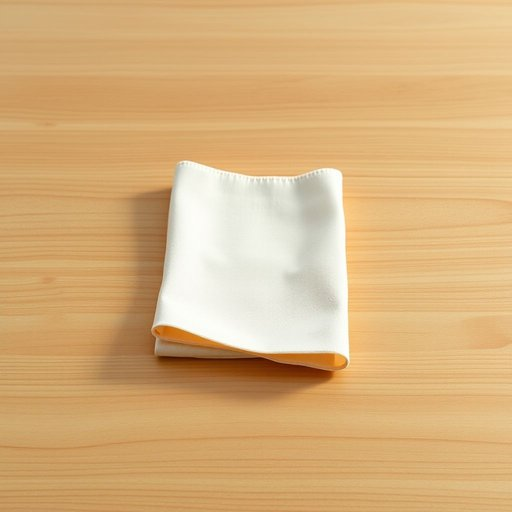

# napkin

<h1 style="font-size: 2.5em; font-weight: 300; letter-spacing: 2px; margin: 0; color: #2c3e50;">
/ˈnæpkɪn/
</h1>

---

---

## 例句

Could you please pass me a clean napkin from the drawer, preferably one with the subtle floral pattern, as I’d rather avoid using the paper towels on the counter for wiping my hands after dinner?

*Could(/kʊd/) you(/ju/) please(/pliz/) pass(/pæs/) me(/mi/) a(/ə/) clean(/klin/) napkin(/ˈnæpkɪn/) from(/frəm/) the(/ðə/) drawer,(/drɔr,/) preferably(/ˈprɛfərəbli/) one(/wən/) with(/wɪθ/) the(/ðə/) subtle(/ˈsətəl/) floral(/ˈflɔrəl/) pattern,(/ˈpætərn,/) as(/ɛz/) I’d(/i’d*/) rather(/ˈrəðər/) avoid(/əˈvɔɪd/) using(/ˈjuzɪŋ/) the(/ðə/) paper(/ˈpeɪpər/) towels(/taʊəlz/) on(/ɔn/) the(/ðə/) counter(/ˈkaʊntər/) for(/fər/) wiping(/ˈwaɪpɪŋ/) my(/maɪ/) hands(/hænz/) after(/ˈæftər/) dinner?(/ˈdɪnər?/)*

**翻译：** 请您帮我从抽屉里取一张干净的餐巾，最好是带有淡雅花纹的那种，因为我更愿意避免用柜台上的纸巾擦手，尤其是在晚饭后。

---

## 解释

napkin作为名词，在家居生活用品语境中主要指餐巾纸或餐巾布，通常用于用餐时擦拭嘴巴或手，以保持清洁整洁，具体使用场合多见于家庭餐桌、餐厅、宴会等用餐环境中，也可指供小孩或病人使用的擦拭物，英语学习者在使用napkin时需注意其作为可数名词，可用复数形式napkins，且通常与动词use、fold、place等搭配，常见表达有fold a napkin（折叠餐巾）、napkin holder（餐巾架）、paper napkin（纸质餐巾）等，此外需区分napkin与serviette的使用，在英式英语中两者常可互换，但在美式英语中napkin更为普遍和正式，词源上，napkin源自古法语nappe意为桌布，加上缩小词缀-kin表示小布，反映了其作为小型布料的本质，中文语境中最准确的翻译是餐巾或餐巾纸，根据材质可细分为布餐巾或纸餐巾，没有褒贬含义，属于中性词汇，但在文化使用上体现了对用餐礼仪和个人卫生的重视。

---

<small style="color: #999; font-size: 0.9em;">2025-07-17 06:22:40</small>

