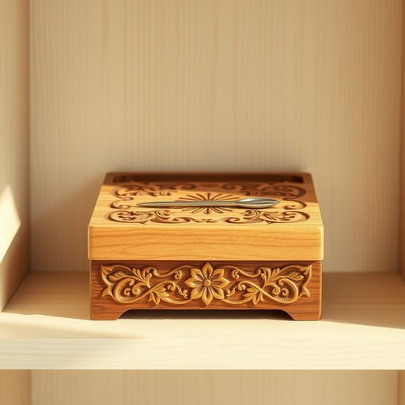

# needle

<h1 style="font-size: 2.5em; font-weight: 300; letter-spacing: 2px; margin: 0; color: #2c3e50;">
/ˈnidəl/
</h1>

---

---

## 例句

Could you please hand me the needle that’s kept in the small wooden box on the top shelf of the cupboard, the one with the intricate floral pattern carved on its lid, because I need to sew this torn button back onto my shirt before we leave for dinner?

*Could(/kʊd/) you(/ju/) please(/pliz/) hand(/hænd/) me(/mi/) the(/ðə/) needle(/ˈnidəl/) that’s(/that’s*/) kept(/kɛpt/) in(/ɪn/) the(/ðə/) small(/smɔl/) wooden(/ˈwʊdən/) box(/bɑks/) on(/ɔn/) the(/ðə/) top(/tɔp/) shelf(/ʃɛlf/) of(/əv/) the(/ðə/) cupboard,(/ˈkəbərd,/) the(/ðə/) one(/wən/) with(/wɪθ/) the(/ðə/) intricate(/ˈɪntrəkət/) floral(/ˈflɔrəl/) pattern(/ˈpætərn/) carved(/kɑrvd/) on(/ɔn/) its(/ɪts/) lid,(/lɪd,/) because(/bɪˈkəz/) I(/aɪ/) need(/nid/) to(/tɪ/) sew(/soʊ/) this(/ðɪs/) torn(/tɔrn/) button(/ˈbətən/) back(/bæk/) onto(/ˈɔntu/) my(/maɪ/) shirt(/ʃərt/) before(/ˌbiˈfɔr/) we(/wi/) leave(/liv/) for(/fər/) dinner?(/ˈdɪnər?/)*

**翻译：** 请你把橱柜顶层架子上那个小木盒子里的针递给我，那个木盒盖子上雕刻着精致的花卉图案，因为我需要在我们去吃晚饭之前，把这颗脱落的扣子缝回我的衬衫上。

---

## 解释

单词needle作为名词在家居生活用品的语境中，通常指的是用于缝纫的“针”，即用金属制成、带有针尖和穿线孔的小工具，适用于修补衣物、缝制布料等具体操作场合。英语学习者在使用needle时需注意其复数形式needles，以及与相关动词搭配，如“thread a needle”（穿针）、“pull the needle through”（将针拉过布料）等常用表达。needle的词源来自古英语nædl，最早指细长刺状物，延伸为缝纫所用的针，体现了该词源自其形状和功能的自然演变。在中文语境中，needle准确对应“针”，强调其作为缝纫工具的实用属性，且通常无特殊褒贬色彩，属于中性词汇。需要注意的是，在不同语境下needle可能有其他含义，如医用注射针，这里强调的是家居生活中的缝针意义。整体而言，理解needle应结合具体使用场合，掌握相关的搭配及语法变化，以便准确表达和理解缝纫活动相关内容。

---

<small style="color: #999; font-size: 0.9em;">2025-07-17 06:22:40</small>

