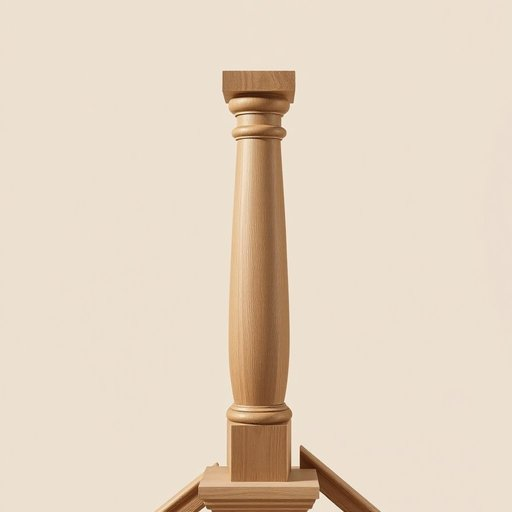

# newel

<h1 style="font-size: 2.5em; font-weight: 300; letter-spacing: 2px; margin: 0; color: #2c3e50;">
/newel*/
</h1>

---

---

## 例句

As the restoration unfolded, the newel post, weathered yet resolute, stood as a testament to the craftsmanship of a bygone era, drawing the eye and anchoring the staircase with an enduring sense of history and artistry.

*As(/ɛz/) the(/ðə/) restoration(/ˌrɛstərˈeɪʃən/) unfolded,(/ənˈfoʊldəd,/) the(/ðə/) newel(/newel*/) post,(/poʊst,/) weathered(/ˈwɛðərd/) yet(/jɛt/) resolute,(/ˈrɛzəˌlut,/) stood(/stʊd/) as(/ɛz/) a(/ə/) testament(/ˈtɛstəmənt/) to(/tɪ/) the(/ðə/) craftsmanship(/ˈkræftsmənˌʃɪp/) of(/əv/) a(/ə/) bygone(/ˈbaɪˌgɔn/) era,(/ˈɪrə,/) drawing(/drɔɪŋ/) the(/ðə/) eye(/aɪ/) and(/ənd/) anchoring(/ˈæŋkərɪŋ/) the(/ðə/) staircase(/ˈstɛrˌkeɪs/) with(/wɪθ/) an(/ən/) enduring(/ɪnˈdʊrɪŋ/) sense(/sɛns/) of(/əv/) history(/ˈhɪstəri/) and(/ənd/) artistry.(/ˈɑrtɪstri./)*

**翻译：** 随着修复工作的进行，那根既饱经风霜又坚定不移的楼梯柱，宛如昔日工艺的见证，吸引着目光，以其持久的历史感和艺术气息牢牢地支撑着整座楼梯。

---

## 解释

英语单词“newel”在家居生活用品领域作为名词，指的是楼梯扶手或栏杆中支撑主立柱，通常位于楼梯转角或楼梯起点、终点处的粗壮立柱。具体使用场合一般涉及楼梯建筑结构及室内装修设计，如描述楼梯的结构细节时会提到“newel post”（扶手柱）。英语学习者使用该词时应注意它主要用作名词，复数形式为“newels”，常见搭配为“newel post”，表达楼梯扶手的支柱部分，较少单独使用“newel”。词源上，“newel”来自中古英语，源自古法语单词“novel”，意为“新的”或“新起点”，后引申为楼梯的主要支柱，象征结构的核心部分。在中文语境中，“newel”准确翻译通常为“楼梯柱”或“扶手柱”，是楼梯结构中的重要部件，承担支撑和装饰功能，无褒贬色彩或特殊文化内涵，属于建筑和室内设计技术用语，使用时多与楼梯整体结构或装修风格联系紧密，了解其功能和位置对于描述或设计楼梯时至关重要。

---

<small style="color: #999; font-size: 0.9em;">2025-07-17 06:22:40</small>

