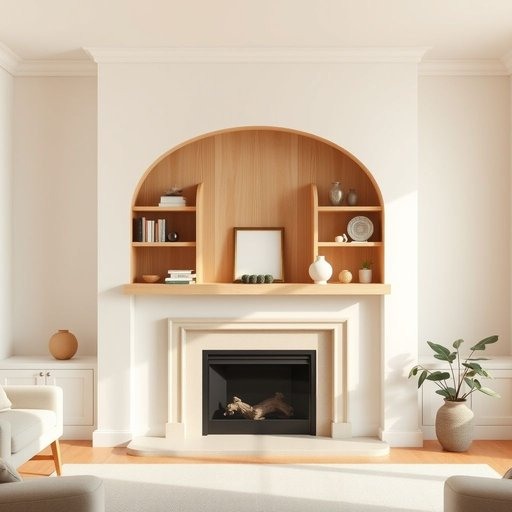

# niche

<h1 style="font-size: 2.5em; font-weight: 300; letter-spacing: 2px; margin: 0; color: #2c3e50;">
/nɪʧ/
</h1>

---

---

## 例句

In the living room, where every inch of space needs to be cleverly utilised, we decided to install a custom-built wooden shelving unit that fits perfectly into the awkward niche above the fireplace, creating not only an elegant display area for our favourite books and ornaments but also a practical storage solution that helps keep the room tidy and inviting.

*In(/ɪn/) the(/ðə/) living(/ˈlɪvɪŋ/) room,(/rum,/) where(/wɛr/) every(/ˈɛvəri/) inch(/ɪnʧ/) of(/əv/) space(/speɪs/) needs(/nidz/) to(/tɪ/) be(/bi/) cleverly(/ˈklɛvərli/) utilised,(/utilised*,/) we(/wi/) decided(/ˌdɪˈsaɪdɪd/) to(/tɪ/) install(/ˌɪnˈstɔl/) a(/ə/) custom-built(/custom-built*/) wooden(/ˈwʊdən/) shelving(/ˈʃɛlvɪŋ/) unit(/ˈjunɪt/) that(/ðət/) fits(/fɪts/) perfectly(/ˈpərfəktli/) into(/ˈɪntu/) the(/ðə/) awkward(/ˈɔkwərd/) niche(/nɪʧ/) above(/əˈbəv/) the(/ðə/) fireplace,(/ˈfaɪərˌpleɪs,/) creating(/kriˈeɪtɪŋ/) not(/nɑt/) only(/ˈoʊnli/) an(/ən/) elegant(/ˈɛləgənt/) display(/dɪˈspleɪ/) area(/ˈɛriə/) for(/fər/) our(/ɑr/) favourite(/ˈfeɪvərɪt/) books(/bʊks/) and(/ənd/) ornaments(/ˈɔrnəmənts/) but(/bət/) also(/ˈɔlsoʊ/) a(/ə/) practical(/ˈpræktɪkəl/) storage(/ˈstɔrɪʤ/) solution(/səˈluʃən/) that(/ðət/) helps(/hɛlps/) keep(/kip/) the(/ðə/) room(/rum/) tidy(/ˈtaɪdi/) and(/ənd/) inviting.(/ˌɪnˈvaɪtɪŋ./)*

**翻译：** 在客厅里，每一寸空间都需要巧妙利用，我们决定安装一个定制的木质书架，完美嵌入壁炉上方那个别致的凹槽中，这不仅为我们喜爱的书籍和装饰品打造了一个优雅的展示区，也提供了一个实用的储物解决方案，帮助保持房间整洁且充满吸引力。

---

## 解释

在家居生活用品的语境中，英语单词“niche”作为名词通常指墙壁或家具中专门凿出的凹槽、壁龛或小空间，用来安放装饰品、书籍或实用物品，既具有实用功能又能起到美观效果。这一用法多见于室内设计、家居布置的描述中，比如“a niche for displaying ornaments”（用于展示装饰品的壁龛）。学习者需要注意，“niche”作为名词时通常是可数名词，前面常搭配冠词如“a”或“the”，且与表空间或细分市场的名词表达搭配较多。此外，还有“niche market”（细分市场）等引申义，但在家居用品场景中重点指物理空间。词源上，“niche”源自法语，原本指建筑物中的壁龛，源自拉丁语“nidus”，意为“巢”，暗示一种保护和安置的空间。中文语境中，“niche”常译为“壁龛”或“凹槽”，强调其作为特定凹陷空间的功能，与“架子”或“柜子”等泛指家具部件不同，体现了一种专门的空间设计感。该词本身无褒贬色彩，但在特定语境下可引申为“适合某人或某物的位置”，带有积极的定位含义。总之，理解“niche”在家居生活用品中的用法，既要注意其具体的物理空间意义，又要掌握其搭配和语法特征，从而准确表达该词的功能与美学价值。

---

<small style="color: #999; font-size: 0.9em;">2025-07-17 06:22:40</small>

