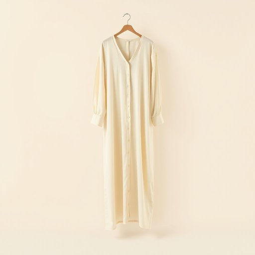

# nightgown

<h1 style="font-size: 2.5em; font-weight: 300; letter-spacing: 2px; margin: 0; color: #2c3e50;">
/nightgown*/
</h1>

---

---

## 例句

After carefully examining the ancient manuscript, the scholar discovered that the subtle nuances of the metaphor were crucial to understanding the poem's deeper meaning, demonstrating that the metaphor plays an essential role in literary analysis.

*After(/ˈæftər/) carefully(/ˈkɛrfəli/) examining(/ɪgˈzæmɪnɪŋ/) the(/ðə/) ancient(/ˈeɪnʧənt/) manuscript,(/ˈmænjəˌskrɪpt,/) the(/ðə/) scholar(/ˈskɑlər/) discovered(/dɪˈskəvərd/) that(/ðət/) the(/ðə/) subtle(/ˈsətəl/) nuances(/ˈnuɑnsɪz/) of(/əv/) the(/ðə/) metaphor(/ˈmɛtəfɔr/) were(/wər/) crucial(/ˈkruʃəl/) to(/tɪ/) understanding(/ˌəndərˈstændɪŋ/) the(/ðə/) poem's(/poem's*/) deeper(/ˈdipər/) meaning,(/ˈminɪŋ,/) demonstrating(/ˈdɛmənˌstreɪtɪŋ/) that(/ðət/) the(/ðə/) metaphor(/ˈmɛtəfɔr/) plays(/pleɪz/) an(/ən/) essential(/ɛˈsɛnʃəl/) role(/roʊl/) in(/ɪn/) literary(/ˈlɪtərˌɛri/) analysis.(/æˈnælɪsɪs./)*

**翻译：** 经过仔细研读这份古代手稿，学者发现隐喻的细微差别对于理解诗歌的深层意蕴至关重要，这充分说明隐喻在文学分析中具有不可或缺的作用。

---

## 解释

英语单词“nightgown”作为名词，主要指女性在夜间穿着的宽松长款睡衣，常用于家居生活中睡觉时的服装。在具体使用场合和语境上，nightgown多用于描述睡衣或睡裙，通常是在家庭、睡觉准备或睡眠相关的对话中出现，比如谈论穿着舒适、睡眠习惯或家庭生活时。英语学习者在使用nightgown时需注意它通常指单件的连身睡衣，且多为女性服装，复数形式为nightgowns；搭配时常见表达包括“wear a nightgown”（穿睡衣）、“silk nightgown”（丝绸睡衣）、“cotton nightgown”（棉质睡衣）等，此外需留心nightgown与类似单词如“pajamas”（睡衣套装）或“robe”（浴袍）之间的区别。词源方面，nightgown由“night”和“gown”合成，“gown”意指长袍，起初用来形容女性穿着的长袍衣物，18世纪开始特指睡觉时穿的长袍，reflect了其夜间穿着的功能。中文语境中，nightgown多准确翻译为“睡裙”或“睡袍”，强调的是女性睡觉时穿着的单件长款衣物，区别于成套睡衣或家居服。从文化内涵角度看，nightgown一般无褒贬意义，属于中性词汇，但在不同文化背景中可能带有温柔、舒适或私密的联想，部分文学作品中也可能通过nightgown传递女性的柔美或休憩氛围。因此，理解nightgown时应结合上下文，既要注意其服装功能性，也要掌握其文化色彩。

---

<small style="color: #999; font-size: 0.9em;">2025-07-17 06:22:40</small>

