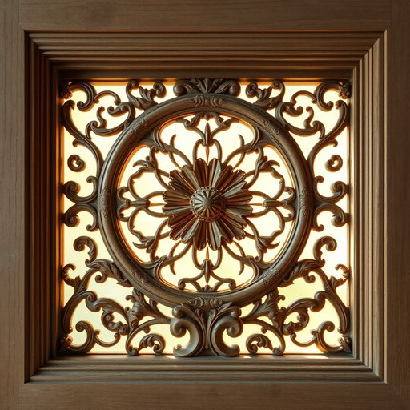

# nightstand

<h1 style="font-size: 2.5em; font-weight: 300; letter-spacing: 2px; margin: 0; color: #2c3e50;">
/ˈnaɪtˌstænd/
</h1>

---

---

## 例句

Could you please move the nightstand closer to the bed tonight, as the lamp resting upon it provides precisely the right amount of light for reading, and I also need the drawer to be easily accessible for my book and glasses?

*Could(/kʊd/) you(/ju/) please(/pliz/) move(/muv/) the(/ðə/) nightstand(/ˈnaɪtˌstænd/) closer(/ˈkloʊzər/) to(/tɪ/) the(/ðə/) bed(/bɛd/) tonight,(/təˈnaɪt,/) as(/ɛz/) the(/ðə/) lamp(/læmp/) resting(/ˈrɛstɪŋ/) upon(/əˈpɑn/) it(/ɪt/) provides(/prəˈvaɪdz/) precisely(/prɪˈsaɪsli/) the(/ðə/) right(/raɪt/) amount(/əˈmaʊnt/) of(/əv/) light(/laɪt/) for(/fər/) reading,(/ˈrɛdɪŋ,/) and(/ənd/) I(/aɪ/) also(/ˈɔlsoʊ/) need(/nid/) the(/ðə/) drawer(/drɔr/) to(/tɪ/) be(/bi/) easily(/ˈizəli/) accessible(/ækˈsɛsəbəl/) for(/fər/) my(/maɪ/) book(/bʊk/) and(/ənd/) glasses?(/ˈglæsɪz?/)*

**翻译：** 今晚能否请您将床头柜移近床边，因为其上的台灯提供了恰到好处的阅读灯光，且我需要方便地取用抽屉内的书籍和眼镜？

---

## 解释

nightstand作为名词指的是放置在卧室床边的小型家具，通常用来放置台灯、闹钟、书籍或其他随手物品，中文中常译为“床头柜”或“床头柜子”。它主要出现在描述卧室家具配置或家居布置的语境中，尤其涉及起居生活便利时使用。英语学习者需要注意nightstand通常为可数名词，常与形容词连用，如“wooden nightstand”（木制床头柜）、“small nightstand”（小型床头柜）等，也常与介词短语连用如“on the nightstand”（在床头柜上）。在使用时，需明确指代具体位置以避免混淆，比如指床边的柜子，而非其他家具。nightstand起源于英语中的night（夜晚）和stand（支架、台座）的组合，最初指夜间放置物品的支架，后来演变为固定的家具形式，体现了实用性与便捷性。中文语境中准确理解为“床头柜”，强调其功能性和摆放位置，没有特殊的褒贬含义，也无明显的文化色彩，但在描述家居环境时是常见且具体的词汇选择。

---

<small style="color: #999; font-size: 0.9em;">2025-07-17 06:22:40</small>

