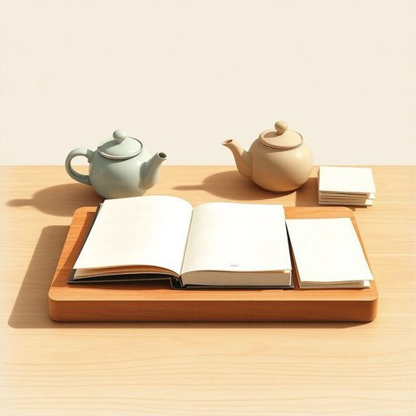

# notebook

<h1 style="font-size: 2.5em; font-weight: 300; letter-spacing: 2px; margin: 0; color: #2c3e50;">
/ˈnoʊtˌbʊk/
</h1>

---

---

## 例句

I left my notebook on the kitchen table, right next to the teapot and that stack of unopened mail, so if you happen to see it while you’re tidying up, could you please bring it to me before I start making dinner?

*I(/aɪ/) left(/lɛft/) my(/maɪ/) notebook(/ˈnoʊtˌbʊk/) on(/ɔn/) the(/ðə/) kitchen(/ˈkɪʧən/) table,(/ˈteɪbəl,/) right(/raɪt/) next(/nɛkst/) to(/tɪ/) the(/ðə/) teapot(/ˈtiˌpɑt/) and(/ənd/) that(/ðət/) stack(/stæk/) of(/əv/) unopened(/əˈnoʊpənd/) mail,(/meɪl,/) so(/soʊ/) if(/ɪf/) you(/ju/) happen(/ˈhæpən/) to(/tɪ/) see(/si/) it(/ɪt/) while(/waɪl/) you’re(/you’re*/) tidying(/tidying*/) up,(/əp,/) could(/kʊd/) you(/ju/) please(/pliz/) bring(/brɪŋ/) it(/ɪt/) to(/tɪ/) me(/mi/) before(/ˌbiˈfɔr/) I(/aɪ/) start(/stɑrt/) making(/ˈmeɪkɪŋ/) dinner?(/ˈdɪnər?/)*

**翻译：** 我把笔记本放在厨房的桌子上，就在茶壶旁边和那摞未拆的邮件旁，如果你整理时刚好看到了，能否在我开始做晚饭前帮我拿过来？

---

## 解释

单词notebook在家居生活用品场景中作为名词，通常指的是随手记事用的笔记本或本子，适用于记录日常事务、购物清单、心得体会等具体使用场合，常见于家庭办公、学习或备忘录的书写中。英语学习者使用该词时需注意，notebook为可数名词，复数形式为notebooks，且通常与动词take、write、keep、buy等搭配，如take a notebook（拿一本笔记本）、write in a notebook（在笔记本上写字），表达时注意使用正确的冠词和数的形式。此外，notebook还有笔记本电脑的含义，但在家居生活用品语境下多指纸质笔记本，不应与电子设备混淆。词源上，notebook由note（笔记）与book（书）复合而成，最早用于指便于携带的小本子，以便随时记录信息。中文语境中一般译为笔记本或记事本，强调其便于记录书写的功能，无特殊褒贬色彩或文化内涵，仅表示一种实用的生活学习工具。

---

<small style="color: #999; font-size: 0.9em;">2025-07-17 06:22:40</small>

