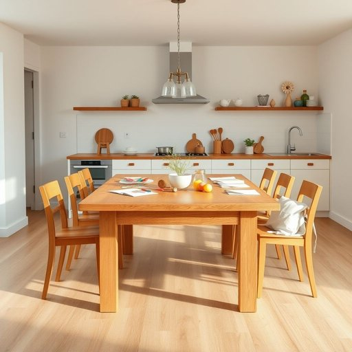

# oak

<h1 style="font-size: 2.5em; font-weight: 300; letter-spacing: 2px; margin: 0; color: #2c3e50;">
/oʊk/
</h1>

---

---

## 例句

The sturdy oak dining table, which my grandparents handed down to us last year and which now takes pride of place in our kitchen, not only serves as a gathering spot for family meals but also doubles as a workspace when the kids spread out their homework and art supplies.

*The(/ðə/) sturdy(/ˈstərdi/) oak(/oʊk/) dining(/ˈdaɪnɪŋ/) table,(/ˈteɪbəl,/) which(/wɪʧ/) my(/maɪ/) grandparents(/ˈgrændˌpɛrənts/) handed(/ˈhændɪd/) down(/daʊn/) to(/tɪ/) us(/ˈjuˈɛs/) last(/læst/) year(/jɪr/) and(/ənd/) which(/wɪʧ/) now(/naʊ/) takes(/teɪks/) pride(/praɪd/) of(/əv/) place(/pleɪs/) in(/ɪn/) our(/ɑr/) kitchen,(/ˈkɪʧən,/) not(/nɑt/) only(/ˈoʊnli/) serves(/sərvz/) as(/ɛz/) a(/ə/) gathering(/ˈgæðərɪŋ/) spot(/spɑt/) for(/fər/) family(/ˈfæməli/) meals(/milz/) but(/bət/) also(/ˈɔlsoʊ/) doubles(/ˈdəbəlz/) as(/ɛz/) a(/ə/) workspace(/workspace*/) when(/wɪn/) the(/ðə/) kids(/kɪdz/) spread(/sprɛd/) out(/aʊt/) their(/ðɛr/) homework(/ˈhoʊmˌwərk/) and(/ənd/) art(/ɑrt/) supplies.(/səˈplaɪz./)*

**翻译：** 这张坚固的橡木餐桌，是祖父母去年传给我们的，如今在厨房里占据着显眼的位置，不仅是家人聚餐的场所，也常常被孩子们用来铺开作业和美术用品，当作临时的工作台。

---

## 解释

英语单词“oak”作为名词在家居生活用品场景中主要指用橡木制成的家具或木材制品，如橡木桌、橡木椅、橡木地板等，通常用于强调材质的坚固、耐用和高档。具体使用时，常见表达包括“oak furniture”（橡木家具）、“oak cabinet”（橡木橱柜）、“oak floor”（橡木地板）等。学习者需要注意，“oak”作为可数名词时指“橡树”（一棵橡树），不可数用时多指橡木材质本身，且其复数形式为“oaks”，但在家居用品中多以不可数名词形式出现。词源上，“oak”源自古英语“āc”，属于日耳曼语族，与德语“Eiche”同源，历史悠久，象征坚固和长寿。在中文语境中，“oak”通常被翻译为“橡木”，在家居用品领域的使用强调木质材质，表达时应根据具体语境确定是指“橡木材”还是“橡树”。该词在文化上常带有自然、稳重和高品质的积极色彩，几乎无贬义，但有时也因橡木家具价格较高，使用时可能隐含一定的豪华或身份象征意味。

---

<small style="color: #999; font-size: 0.9em;">2025-07-17 06:22:40</small>

