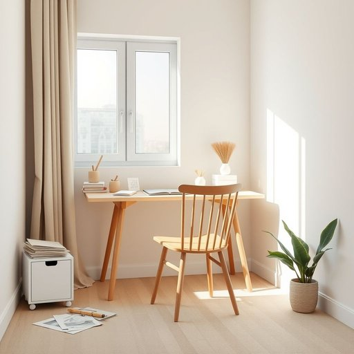

# office

<h1 style="font-size: 2.5em; font-weight: 300; letter-spacing: 2px; margin: 0; color: #2c3e50;">
/ˈɔfəs/
</h1>

---

---

## 例句

After rearranging the living room furniture to create more space for guests, she realized that the small corner by the window, which was usually cluttered with papers and stationery, could be transformed into a cozy home office where she could work efficiently without distractions.

*After(/ˈæftər/) rearranging(/ˌriərˈeɪnʤɪŋ/) the(/ðə/) living(/ˈlɪvɪŋ/) room(/rum/) furniture(/ˈfərnɪʧər/) to(/tɪ/) create(/kriˈeɪt/) more(/mɔr/) space(/speɪs/) for(/fər/) guests,(/gɛsts,/) she(/ʃi/) realized(/ˈriəˌlaɪzd/) that(/ðət/) the(/ðə/) small(/smɔl/) corner(/ˈkɔrnər/) by(/baɪ/) the(/ðə/) window,(/ˈwɪndoʊ,/) which(/wɪʧ/) was(/wɑz/) usually(/ˈjuʒəwəli/) cluttered(/ˈklətərd/) with(/wɪθ/) papers(/ˈpeɪpərz/) and(/ənd/) stationery,(/ˈsteɪʃəˌnɛri,/) could(/kʊd/) be(/bi/) transformed(/trænsˈfɔrmd/) into(/ˈɪntu/) a(/ə/) cozy(/ˈkoʊzi/) home(/hoʊm/) office(/ˈɔfəs/) where(/wɛr/) she(/ʃi/) could(/kʊd/) work(/wərk/) efficiently(/ɪˈfɪʃəntli/) without(/wɪˈθaʊt/) distractions.(/dɪˈstrækʃənz./)*

**翻译：** 在重新布置客厅家具以为客人腾出更多空间后，她发现靠窗的小角落，那里平时杂乱堆放着文件和文具，可以改造成为一个温馨的家庭办公区，让她能够高效且不受干扰地工作。

---

## 解释

英语单词“office”在家居生活用品的语境中作为名词，主要指的是家中专门用于办公或处理文书工作的空间，即“书房”或“办公室”。具体使用场合通常是指家庭内部设置的用来放置办公家具如办公桌、椅子、文件柜及电脑等，以便学习、工作或管理家庭事务的房间，这在现代家居中尤为常见。英语学习者在使用“office”时需注意它是可数名词，通常用复数形态“offices”指多个办公场所，在表示某个特定的办公室时通常会加冠词，如“the office”；此外，常见搭配如“home office”（家庭办公室）、“office furniture”（办公家具）、“office supplies”（办公用品）等，表达时可根据语境选择合适的词组。“office”的词源来自拉丁语“officium”，意为职责或服务，这反映了其最初作为职务或政府机构的含义，后逐渐演变为专门办公的场所。在中文语境中，准确翻译为“办公室”或“书房”，但在强调家庭生活场景时，“书房”更贴切，避免与单位或企业的正式办公室混淆。从文化角度看，“office”作为家庭内的工作空间，反映出现代生活中办公与居家的融合趋势，无特别褒贬色彩，但体现了一种现代专业化和生活舒适化的生活方式。

---

<small style="color: #999; font-size: 0.9em;">2025-07-17 06:22:40</small>

