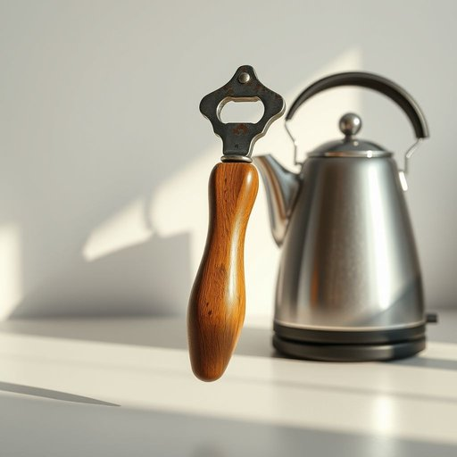

# opener

<h1 style="font-size: 2.5em; font-weight: 300; letter-spacing: 2px; margin: 0; color: #2c3e50;">
/ˈoʊpənər/
</h1>

---

---

## 例句

Could you please pass me the opener that’s hanging next to the kettle—the one with the wooden handle and the slightly rusted metal, which Grandma bought last year at that little vintage shop down the High Street—because I can’t seem to crack open this stubborn jar of pickles without it?

*Could(/kʊd/) you(/ju/) please(/pliz/) pass(/pæs/) me(/mi/) the(/ðə/) opener(/ˈoʊpənər/) that’s(/that’s*/) hanging(/ˈhæŋɪŋ/) next(/nɛkst/) to(/tɪ/) the(/ðə/) kettle—the(/kettle—the*/) one(/wən/) with(/wɪθ/) the(/ðə/) wooden(/ˈwʊdən/) handle(/ˈhændəl/) and(/ənd/) the(/ðə/) slightly(/sˈlaɪtli/) rusted(/ˈrəstɪd/) metal,(/ˈmɛtəl,/) which(/wɪʧ/) Grandma(/ˈgrændmɑ/) bought(/bɔt/) last(/læst/) year(/jɪr/) at(/æt/) that(/ðət/) little(/ˈlɪtəl/) vintage(/ˈvɪntɪʤ/) shop(/ʃɑp/) down(/daʊn/) the(/ðə/) High(/haɪ/) Street—because(/street—because*/) I(/aɪ/) can’t(/can’t*/) seem(/sim/) to(/tɪ/) crack(/kræk/) open(/ˈoʊpən/) this(/ðɪs/) stubborn(/ˈstəbərn/) jar(/ʤɑr/) of(/əv/) pickles(/ˈpɪkəlz/) without(/wɪˈθaʊt/) it?(/ɪt?/)*

**翻译：** 你能把挂在水壶旁边的开瓶器递给我吗？就是那个带木柄、金属部分略微生锈的开瓶器，是奶奶去年在那条大街上一家小复古店买的——因为没有它，我实在打不开这只倔强的泡菜罐。

---

## 解释

英语单词“opener”在家居生活用品场景中作为名词，通常指的是用于打开瓶盖、罐头、盒子等物品的工具，如瓶起子（bottle opener）、罐头开罐器（can opener）等，具体使用场合多为厨房或餐桌环境，涉及饮料瓶、食品包装的开启。英语学习者在使用“opener”时需注意其后常接限定词或具体说明类型的词组，如“bottle opener”“can opener”，以明确具体功能，同时“opener”作为名词不可数或可数均有，通常指特定的开瓶器时为可数名词。语法上它一般用单数或复数形式，且多与表示物品的名词搭配构成复合名词，发音为[ˈoʊpənər]。词源方面，“opener”来自动词“open”的现在分词形式加名词后缀“-er”，表示“执行打开动作的工具或人”，起源简单直接，符合英语构词法。中文语境中，“opener”应准确翻译为“开瓶器”、“开罐器”等具体名称，根据实际用途而定，强调工具性质，无褒贬色彩，属于中性词汇，常见于家庭生活实用工具类表达。该词无特殊文化隐喻或俚语含义，使用时需结合上下文明确指代工具种类以避免歧义。

---

<small style="color: #999; font-size: 0.9em;">2025-07-17 06:22:40</small>

