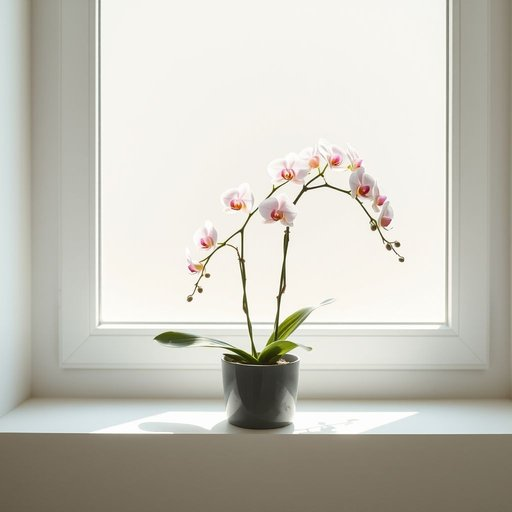

# orchid

<h1 style="font-size: 2.5em; font-weight: 300; letter-spacing: 2px; margin: 0; color: #2c3e50;">
/ˈɔrkəd/
</h1>

---

---

## 例句

The delicate orchid, which I carefully placed on the windowsill to catch the morning light without direct sun exposure, has blossomed beautifully this week, adding an elegant touch of colour and sophistication to our otherwise minimalistic living room décor.

*The(/ðə/) delicate(/ˈdɛləkət/) orchid,(/ˈɔrkəd,/) which(/wɪʧ/) I(/aɪ/) carefully(/ˈkɛrfəli/) placed(/pleɪst/) on(/ɔn/) the(/ðə/) windowsill(/windowsill*/) to(/tɪ/) catch(/kæʧ/) the(/ðə/) morning(/ˈmɔrnɪŋ/) light(/laɪt/) without(/wɪˈθaʊt/) direct(/dɪˈrɛkt/) sun(/sən/) exposure,(/ɪkˈspoʊʒər,/) has(/həz/) blossomed(/ˈblɑsəmd/) beautifully(/ˈbjutəfli/) this(/ðɪs/) week,(/wik,/) adding(/ˈædɪŋ/) an(/ən/) elegant(/ˈɛləgənt/) touch(/təʧ/) of(/əv/) colour(/ˈkələr/) and(/ənd/) sophistication(/səˌfɪstəˈkeɪʃən/) to(/tɪ/) our(/ɑr/) otherwise(/ˈəðərˌwaɪz/) minimalistic(/minimalistic*/) living(/ˈlɪvɪŋ/) room(/rum/) décor.(/décor*./)*

**翻译：** 我小心翼翼地将那株娇嫩的兰花放在窗台上，让它沐浴晨光却避免了直射阳光，结果这周它绽放得格外美丽，为我们本就简约的客厅装饰增添了一抹优雅的色彩与别致的气息。

---

## 解释

英语单词“orchid”作为名词，在家居生活用品场景中通常指的是“兰花”，是一类常见的观赏植物，常用于室内装饰以提升环境美感和自然气息。具体使用场合多见于描述室内植物布置、家居园艺或花卉市场等语境，如“The living room looks elegant with an orchid on the coffee table”（客厅里咖啡桌上的兰花使环境显得优雅）。英语学习者在使用“orchid”时要注意，它作为可数名词，可以直接用作单数或复数（orchids）；此外，常见搭配包括“orchid plant”（兰花植株）、“orchid flower”（兰花花朵）、“orchid arrangement”（兰花花艺布置）等。此外，“orchid”也可以用作形容词，表示兰花色的淡紫色，但在家居用品中较少见。词源方面，“orchid”来源于希腊语“orkhis”，意为睾丸，因其地下部分的球茎形状而得名，入英语约在17世纪初，带有一定的科学与植物学背景。在中文语境中，“orchid”准确的翻译是“兰花”，该词无特殊褒贬含义，文化上兰花象征高雅、纯洁与尊贵，常见于中国文化中的文人墨客诗词中，象征品格高洁。因此，在家居生活用品中用“orchid”指代兰花时，既体现其植物属性，也常含有提升格调、美化环境的隐含意义。

---

<small style="color: #999; font-size: 0.9em;">2025-07-17 06:22:40</small>

