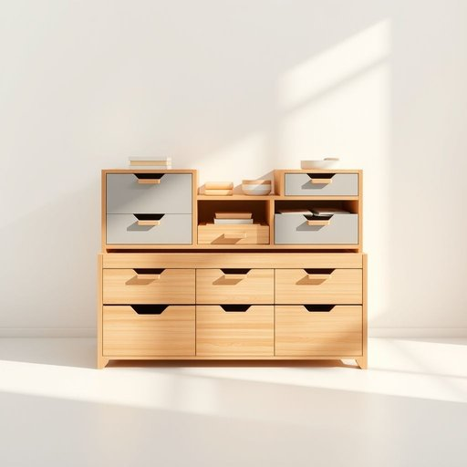

# organiser

<h1 style="font-size: 2.5em; font-weight: 300; letter-spacing: 2px; margin: 0; color: #2c3e50;">
/organiser*/
</h1>

---

---

## 例句

After hours of meticulous research, she discovered that the intricate design of the ancient artifact not only revealed hidden cultural symbols but also provided invaluable insights into the civilization’s technological advancements, which had been previously underestimated by historians.

*After(/ˈæftər/) hours(/aʊərz/) of(/əv/) meticulous(/məˈtɪkjələs/) research,(/ˈrisərʧ,/) she(/ʃi/) discovered(/dɪˈskəvərd/) that(/ðət/) the(/ðə/) intricate(/ˈɪntrəkət/) design(/dɪˈzaɪn/) of(/əv/) the(/ðə/) ancient(/ˈeɪnʧənt/) artifact(/ˈɑrtəˌfækt/) not(/nɑt/) only(/ˈoʊnli/) revealed(/rɪˈvild/) hidden(/ˈhɪdən/) cultural(/ˈkəlʧərəl/) symbols(/ˈsɪmbəlz/) but(/bət/) also(/ˈɔlsoʊ/) provided(/prəˈvaɪdɪd/) invaluable(/ˌɪnˈvæljəbəl/) insights(/ˈɪnˌsaɪts/) into(/ˈɪntu/) the(/ðə/) civilization’s(/civilization’s*/) technological(/ˌtɛknəˈlɑʤɪkəl/) advancements,(/ədˈvænsmənts,/) which(/wɪʧ/) had(/hæd/) been(/bɪn/) previously(/ˈpriviəsli/) underestimated(/ˈəndərˈɛstəˌmeɪtɪd/) by(/baɪ/) historians.(/hɪˈstɔriənz./)*

**翻译：** 经过数小时的细致研究，她发现这件古代文物复杂的设计不仅揭示了隐藏的文化符号，还为文明的技术进步提供了宝贵的见解，而这些进步此前一直被历史学家所低估。

---

## 解释

“organiser”作为名词在家居生活用品的英语语境中，通常指用于整理和分类物品的工具或容器，比如收纳盒、文件夹、抽屉隔板等，帮助用户保持空间整洁，便于查找和管理物品。这类单词常出现在家居整理、办公用品或个人物品管理的描述中，使用时多涉及具体物品的描述，如desk organiser（办公桌整理盒）、makeup organiser（化妆品收纳盒）等。英语学习者在使用“organiser”时需注意其词性为名词，常用的搭配有形容词修饰如plastic organiser（塑料收纳盒）、small organiser（小型收纳盒），或者与具体用途名词组合构成复合名词，同时“organiser”在英式英语中拼写为“organiser”，美式英语对应拼写为“organizer”，但含义完全相同，均指“整理者”或“整理工具”。该词源自拉丁语“organum”，意为工具或器官，后经法语“organiser”演变为动词“组织、安排”，再作名词使用，指代能帮助组织和分类的物品或人。在中文语境中，“organiser”较准确的翻译为“整理器”、“收纳盒”、“分类箱”或“收纳用具”等，强调其功能和用途，而非抽象概念。需注意的是，该词在家居用品语境下无明显褒贬色彩或文化负面含义，是中性词，使用时主要体现实用和功能性，有时可用于强调家庭生活或工作环境的条理性和高效管理，体现现代生活对井然有序的追求。

---

<small style="color: #999; font-size: 0.9em;">2025-07-17 06:22:40</small>

