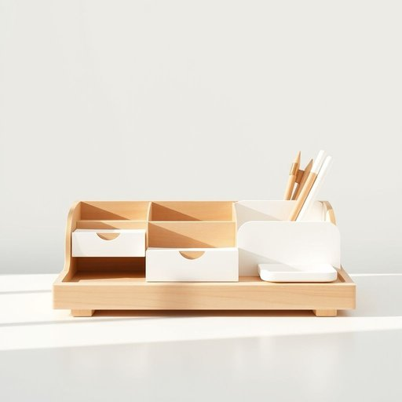

# organizer

<h1 style="font-size: 2.5em; font-weight: 300; letter-spacing: 2px; margin: 0; color: #2c3e50;">
/ˈɔrgəˌnaɪzər/
</h1>

---

---

## 例句

The event organizer coordinated with the venue staff and vendors to ensure that every detail of the conference ran smoothly, from the registration process to the closing reception, making it a memorable experience for all attendees.

*The(/ðə/) event(/ɪˈvɛnt/) organizer(/ˈɔrgəˌnaɪzər/) coordinated(/koʊˈɔrdəneɪtɪd/) with(/wɪθ/) the(/ðə/) venue(/ˈvɛnju/) staff(/stæf/) and(/ənd/) vendors(/ˈvɛndərz/) to(/tɪ/) ensure(/ɪnˈʃʊr/) that(/ðət/) every(/ˈɛvəri/) detail(/ˈditeɪl/) of(/əv/) the(/ðə/) conference(/ˈkɑnfərəns/) ran(/ræn/) smoothly,(/sˈmuðli,/) from(/frəm/) the(/ðə/) registration(/ˌrɛʤɪˈstreɪʃən/) process(/ˈprɔˌsɛs/) to(/tɪ/) the(/ðə/) closing(/ˈkloʊzɪŋ/) reception,(/rɪˈsɛpʃən,/) making(/ˈmeɪkɪŋ/) it(/ɪt/) a(/ə/) memorable(/ˈmɛmərəbəl/) experience(/ɪkˈspɪriəns/) for(/fər/) all(/ɔl/) attendees.(/əˈtɛnˈdiz./)*

**翻译：** 活动组织者与场地工作人员及供应商紧密协调，确保从注册流程到闭幕招待的每一个细节都顺利进行，使全体与会者拥有一次难忘的体验。

---

## 解释

单词“organizer”在家居生活用品的语境中作为名词，通常指用来整理、分类和存放物品的工具或容器，如收纳盒、隔断、文件夹等，帮助保持空间整洁有序。具体使用场合多见于描述家中柜子、抽屉、办公桌或衣柜内的整理配件，例如“desk organizer”（办公桌收纳盒）、“drawer organizer”（抽屉分隔器）等。英语学习者在使用“organizer”时需注意，其基本结构是名词，后面可以加复数-s，且常与表示位置或物品类型的名词连用形成复合名词，如“storage organizer”，表示具体用途的细化，而且其作为工具类名词时，多有明确的功能指向。此词源自拉丁语“organizare”，意为“组织”，经过法语和英语演变，现代含义引申为能够帮助规划或整理的人或物，在家居领域则专指帮助收纳和分类的器具。中文语境中，“organizer”准确对应“收纳盒”、“整理器”、“收纳箱”等，强调其实用性和辅助整理功能，无贬义，但有时可带有积极的效率与整洁的正面色彩。总体而言，“organizer”强调有序和便捷的整理理念，是家居生活中提升空间利用率的重要用品名称。

---

<small style="color: #999; font-size: 0.9em;">2025-07-17 06:22:40</small>

