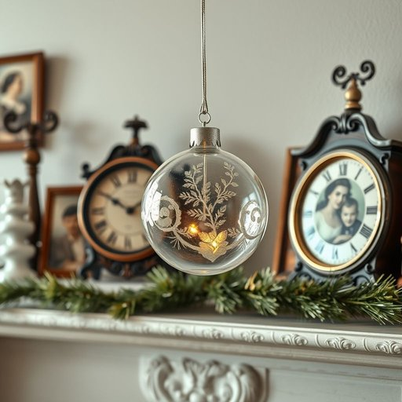

# ornament

<h1 style="font-size: 2.5em; font-weight: 300; letter-spacing: 2px; margin: 0; color: #2c3e50;">
/ˈɔrnəmənt/
</h1>

---

---

## 例句

I carefully placed the delicate glass ornament, which my grandmother had handed down to me decades ago and which sparkled with intricate painted details, on the mantelpiece alongside the antique clock and a collection of family photographs, hoping it would add a touch of warmth and nostalgia to the living room’s understated decor.

*I(/aɪ/) carefully(/ˈkɛrfəli/) placed(/pleɪst/) the(/ðə/) delicate(/ˈdɛləkət/) glass(/glæs/) ornament,(/ˈɔrnəmənt,/) which(/wɪʧ/) my(/maɪ/) grandmother(/ˈgrændˌməðər/) had(/hæd/) handed(/ˈhændɪd/) down(/daʊn/) to(/tɪ/) me(/mi/) decades(/ˈdɛkeɪdz/) ago(/əˈgoʊ/) and(/ənd/) which(/wɪʧ/) sparkled(/ˈspɑrkəld/) with(/wɪθ/) intricate(/ˈɪntrəkət/) painted(/ˈpeɪnɪd/) details,(/ˈditeɪlz,/) on(/ɔn/) the(/ðə/) mantelpiece(/mantelpiece*/) alongside(/əˈlɔŋˈsaɪd/) the(/ðə/) antique(/ænˈtik/) clock(/klɑk/) and(/ənd/) a(/ə/) collection(/kəˈlɛkʃən/) of(/əv/) family(/ˈfæməli/) photographs,(/ˈfoʊtəˌgræfs,/) hoping(/ˈhoʊpɪŋ/) it(/ɪt/) would(/wʊd/) add(/æd/) a(/ə/) touch(/təʧ/) of(/əv/) warmth(/wɔrmθ/) and(/ənd/) nostalgia(/nɔˈstælʤə/) to(/tɪ/) the(/ðə/) living(/ˈlɪvɪŋ/) room’s(/room’s*/) understated(/ˈəndərˌsteɪtɪd/) decor.(/ˈdeɪkɔr./)*

**翻译：** 我小心翼翼地将那件由祖母几十年前传给我的精致玻璃饰品放在壁炉架上，饰品上绘有细腻的图案，闪烁着光彩，我将它与古董钟和一组家族照片并列摆放，期望它能为客厅简约的装饰增添一抹温馨与怀旧的气息。

---

## 解释

单词“ornament”作为名词，在家居生活用品的语境中通常指用来装饰家居环境的小物件或装饰品，如摆件、挂饰、灯饰上的装饰部分等，用于美化空间或增加视觉趣味。具体使用场合包括描述客厅、卧室、圣诞节装饰、节庆布置等，常见表达有“Christmas ornament”（圣诞装饰品）、“decorative ornaments”（装饰品）等。英语学习者应注意“ornament”作为可数名词时，需根据数量变化使用复数形式“ornaments”；同时，其常与形容词如“decorative”（装饰的）、“small”（小巧的）连用。在语法上，“ornament”通常做主语或宾语，也可作为定语修饰其他名词。该词源自拉丁语“ornamentum”，意为“装饰品、饰物”，根源在于动词“ornare”，意为“装饰、修饰”，反映其本质为对物品的美化作用。在中文语境中，准确翻译为“装饰品”或“饰品”，强调其辅助美化空间的功能，而非功能性用品。该词一般无贬义，属于中性词，体现了审美和文化装饰的需求，有时也暗示某种审美趣味或文化氛围，使用时应避免与实用家具或结构部件混淆。

---

<small style="color: #999; font-size: 0.9em;">2025-07-17 06:22:40</small>

