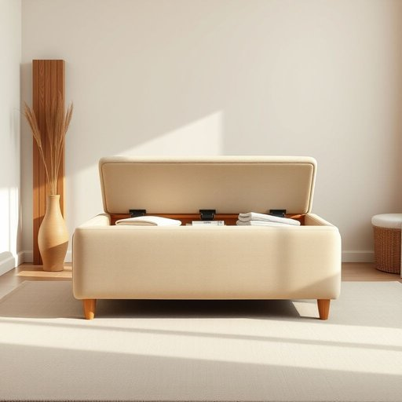

# ottoman

<h1 style="font-size: 2.5em; font-weight: 300; letter-spacing: 2px; margin: 0; color: #2c3e50;">
/ˈɑtəmən/
</h1>

---

---

## 例句

After a long day of tidying the living room and rearranging the cushions on the sofa, she finally sank down onto the plush ottoman, which not only doubled as a comfortable footrest but also cleverly concealed extra storage space for blankets and magazines, making it an indispensable piece of furniture in her cosy, yet efficiently organised, home.

*After(/ˈæftər/) a(/ə/) long(/lɔŋ/) day(/deɪ/) of(/əv/) tidying(/tidying*/) the(/ðə/) living(/ˈlɪvɪŋ/) room(/rum/) and(/ənd/) rearranging(/ˌriərˈeɪnʤɪŋ/) the(/ðə/) cushions(/ˈkʊʃənz/) on(/ɔn/) the(/ðə/) sofa,(/ˈsoʊfə,/) she(/ʃi/) finally(/ˈfaɪnəli/) sank(/sæŋk/) down(/daʊn/) onto(/ˈɔntu/) the(/ðə/) plush(/pləʃ/) ottoman,(/ˈɑtəmən,/) which(/wɪʧ/) not(/nɑt/) only(/ˈoʊnli/) doubled(/ˈdəbəld/) as(/ɛz/) a(/ə/) comfortable(/ˈkəmfərtəbəl/) footrest(/footrest*/) but(/bət/) also(/ˈɔlsoʊ/) cleverly(/ˈklɛvərli/) concealed(/kənˈsild/) extra(/ˈɛkstrə/) storage(/ˈstɔrɪʤ/) space(/speɪs/) for(/fər/) blankets(/ˈblæŋkəts/) and(/ənd/) magazines,(/ˈmægəˌzinz,/) making(/ˈmeɪkɪŋ/) it(/ɪt/) an(/ən/) indispensable(/ˌɪndɪˈspɛnsəbəl/) piece(/pis/) of(/əv/) furniture(/ˈfərnɪʧər/) in(/ɪn/) her(/hər/) cosy,(/ˈkoʊzi,/) yet(/jɛt/) efficiently(/ɪˈfɪʃəntli/) organised,(/organised*,/) home.(/hoʊm./)*

**翻译：** 经过一整天整理客厅和重新摆放沙发上的靠垫后，她终于坐到了那张柔软的脚凳上。那脚凳不仅是一把舒适的脚凳，还巧妙地藏有存放毯子和杂志的额外储物空间，成为她温馨而高效整洁的家中不可或缺的家具。

---

## 解释

“ottoman”作为家居生活用品名词，通常指一种无靠背、低矮且通常带有软垫的长凳或脚凳，多用于客厅或休息区，供人坐或搁脚。具体使用场合多见于家具描述、室内装饰或生活场景，如“a comfortable ottoman”表示一种舒适的软凳。在语法方面，“ottoman”是可数名词，可以用单数或复数形式（ottomans），常与形容词连用描述其风格或材质，如“leather ottoman”或“storage ottoman”（带储物功能的软凳）；此外，它还可作为搭配短语中的中心词出现，如“footstool and ottoman set”。在词源上，“ottoman”源自奥斯曼帝国（Ottoman Empire），最初指该帝国风格的布艺家具，后来泛指此类坐具，其设计特点反映了东方装饰风格。中文语境中，ottoman通常翻译为“奥斯曼脚凳”或“奥斯曼沙发凳”，但实际上它不等同于传统沙发，而是一种多功能的软垫矮凳，因此应根据具体情境译为“软脚凳”“矮凳”或“沙发脚凳”。需要注意的是，英语中“ottoman”主要指家具，且无褒贬色彩，但在文化层面上，其名称带有浓厚的历史和地域特色，反映了东西方家具设计的交融。英语学习者应避免将其误用为传统沙发或椅子，正确理解其功能和样式是准确表达的关键。

---

<small style="color: #999; font-size: 0.9em;">2025-07-17 06:22:40</small>

