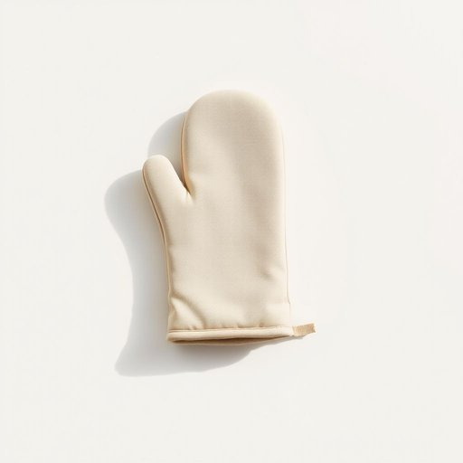

# oven-glove

<h1 style="font-size: 2.5em; font-weight: 300; letter-spacing: 2px; margin: 0; color: #2c3e50;">
/oven-glove*/
</h1>

---

---

## 例句

The architect’s blueprint was a masterpiece of intricate design, showcasing not only the building’s structural integrity but also his unparalleled creativity.

*The(/ðə/) architect’s(/architect’s*/) blueprint(/ˈbluˌprɪnt/) was(/wɑz/) a(/ə/) masterpiece(/ˈmæstərˌpis/) of(/əv/) intricate(/ˈɪntrəkət/) design,(/dɪˈzaɪn,/) showcasing(/ˈʃoʊkeɪsɪŋ/) not(/nɑt/) only(/ˈoʊnli/) the(/ðə/) building’s(/building’s*/) structural(/ˈstrəkʧərəl/) integrity(/ˌɪnˈtɛgrəti/) but(/bət/) also(/ˈɔlsoʊ/) his(/hɪz/) unparalleled(/ənˈpɛrəˌlɛld/) creativity.(/ˌkrieɪˈtɪvəti./)*

**翻译：** 建筑师的蓝图堪称精妙绝伦的设计杰作，不仅展现了建筑的结构坚固，更彰显了他无与伦比的创造力。

---

## 解释

英语单词“oven-glove”作为名词，指的是厨房中用于保护手部避免被烤箱或热锅烫伤的手套，通常由耐热材料制成，使用时戴在手上以便安全地拿取热的餐具或烤盘。它常见于家居生活用品的语境中，尤其涉及烹饪、烘焙等场合，如从烤箱取出热食时使用。“oven-glove”在语法上为复合名词，构成方式为“oven”（烤箱）加“glove”（手套），一般作为单数或复数（oven-gloves）名词使用，且多为可数名词，后接的动词需要与其数保持一致。此外，英语学习者需注意在英式英语中“oven-glove”较为常见，而美式英语中常用“oven mitt”表达相同物品。常见搭配有“put on an oven-glove”（戴上烤箱手套）、“use an oven-glove to take out the tray”（用烤箱手套拿出烤盘）等，表达安全操作的同时增强语境的自然性。词源方面，“oven-glove”由“oven”（源于中古英语“ofen”，意思是烤箱）和“glove”（手套，源自古英语“glof”）组合而成，反映出该物品的功能性，即专门用于烤箱环境的手套。从文化角度看，该词中性无褒贬含义，但体现了英美烹饪文化中对厨房安全的重视。在中文语境下，“oven-glove”准确翻译为“烤箱手套”或“隔热手套”，强调其保护作用且区别于普通家用手套，便于理解其特殊用途和功能，普遍用于描述家用厨房安全用品，具有明确且实用的含义。

---

<small style="color: #999; font-size: 0.9em;">2025-07-17 06:22:40</small>

