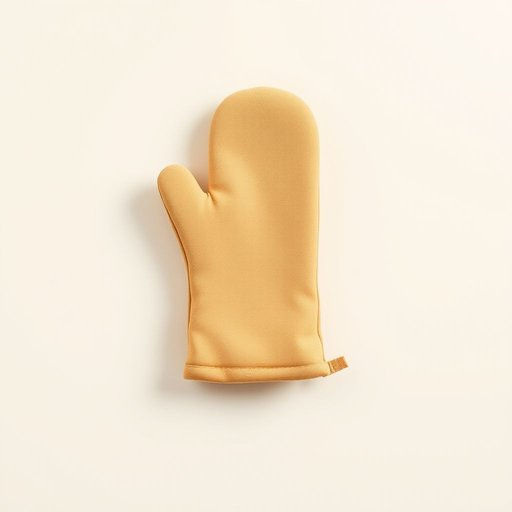

# oven-mitt

<h1 style="font-size: 2.5em; font-weight: 300; letter-spacing: 2px; margin: 0; color: #2c3e50;">
/oven-mitt*/
</h1>

---

---

## 例句

Before taking the piping hot tray out of the oven, she carefully slipped on her floral-patterned oven-mitt, which not only protected her hand from the scorching heat but also added a touch of homely charm to the otherwise sterile kitchen environment.

*Before(/ˌbiˈfɔr/) taking(/ˈteɪkɪŋ/) the(/ðə/) piping(/ˈpaɪpɪŋ/) hot(/hɑt/) tray(/treɪ/) out(/aʊt/) of(/əv/) the(/ðə/) oven,(/ˈəvən,/) she(/ʃi/) carefully(/ˈkɛrfəli/) slipped(/slɪpt/) on(/ɔn/) her(/hər/) floral-patterned(/floral-patterned*/) oven-mitt,(/oven-mitt*,/) which(/wɪʧ/) not(/nɑt/) only(/ˈoʊnli/) protected(/prəˈtɛktɪd/) her(/hər/) hand(/hænd/) from(/frəm/) the(/ðə/) scorching(/ˈskɔrʧɪŋ/) heat(/hit/) but(/bət/) also(/ˈɔlsoʊ/) added(/ˈædɪd/) a(/ə/) touch(/təʧ/) of(/əv/) homely(/ˈhoʊmli/) charm(/ʧɑrm/) to(/tɪ/) the(/ðə/) otherwise(/ˈəðərˌwaɪz/) sterile(/ˈstɛrəl/) kitchen(/ˈkɪʧən/) environment.(/ɪnˈvaɪrənmənt./)*

**翻译：** 在将烫手的烤盘从烤箱中取出之前，她小心地戴上了那只印有花卉图案的隔热手套，这不仅保护了她的手免受炽热的烘烤温度伤害，也为这原本冷清的厨房环境增添了一抹温馨的魅力。

---

## 解释

“oven-mitt”作为名词，指的是厨房中用于保护手部免受烤箱高温伤害的厚实隔热手套，常见于家居生活用品的语境中，尤其是在烘焙或烹饪场合，如取出热烤盘、锅具时使用。英语学习者应注意该词为复合名词，通常作单数或复数形式（oven-mitts或oven mitts），并常与动词搭配使用，如“put on an oven-mitt”（戴上隔热手套）、“use an oven-mitt to handle hot dishes”，在表达技巧上，oven-mitt后通常加上介词短语表示用途，如“oven-mitt for baking”；此外，与之相关的形容词有“heat-resistant”。词源上，“oven”意指烤箱，“mitt”来自中世纪英语，意指手套形状的覆盖物，合成词“oven-mitt”意为专门用于烤箱操作的手套。从文化上看，oven-mitt是一种实用家居用品，语言色彩中性，无褒贬含义。中文译为“隔热手套”或“烤箱手套”，强调其防热功能，准确理解时应结合使用场合，避免误解为普通手套或装饰性手套。总体来看，oven-mitt是厨房安全的必备工具，英语表达中需结合语境和习惯搭配使用，以确保沟通准确流畅。

---

<small style="color: #999; font-size: 0.9em;">2025-07-17 06:22:40</small>

