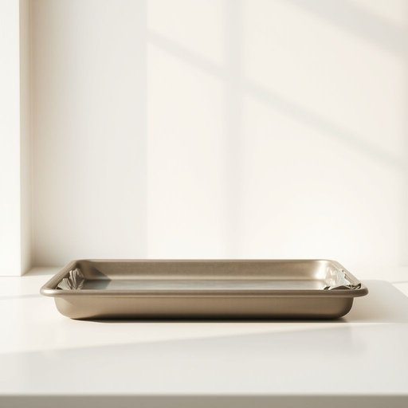

# oven-tray

<h1 style="font-size: 2.5em; font-weight: 300; letter-spacing: 2px; margin: 0; color: #2c3e50;">
/oven-tray*/
</h1>

---

---

## 例句

Before you slide the roast chicken into the oven, make sure the oven-tray is properly greased and lined with foil, so that it not only catches the drippings that can be used for gravy but also makes the cleaning up afterwards much easier.

*Before(/ˌbiˈfɔr/) you(/ju/) slide(/slaɪd/) the(/ðə/) roast(/roʊst/) chicken(/ˈʧɪkən/) into(/ˈɪntu/) the(/ðə/) oven,(/ˈəvən,/) make(/meɪk/) sure(/ʃʊr/) the(/ðə/) oven-tray(/oven-tray*/) is(/ɪz/) properly(/ˈprɑpərli/) greased(/grist/) and(/ənd/) lined(/laɪnd/) with(/wɪθ/) foil,(/fɔɪl,/) so(/soʊ/) that(/ðət/) it(/ɪt/) not(/nɑt/) only(/ˈoʊnli/) catches(/ˈkæʧɪz/) the(/ðə/) drippings(/drippings*/) that(/ðət/) can(/kən/) be(/bi/) used(/juzd/) for(/fər/) gravy(/ˈgreɪvi/) but(/bət/) also(/ˈɔlsoʊ/) makes(/meɪks/) the(/ðə/) cleaning(/ˈklinɪŋ/) up(/əp/) afterwards(/ˈæftərwərdz/) much(/məʧ/) easier.(/ˈiziər./)*

**翻译：** 在将烤鸡放入烤箱之前，务必确保烤盘已妥善涂油并铺好锡纸，这样不仅能接住滴落的肉汁以备制作肉汁酱，还能大大简化后续的清洁工作。

---

## 解释

英语单词“oven-tray”作为名词，指的是放入烤箱中用来烘烤或加热食物的托盘，通常由金属制成，能够耐高温，常见于厨房家居生活用品中。具体使用场合包括烘焙、烤制肉类、蔬菜或烘烤糕点时，炉具中用来承载食材避免油脂流淌或防止食物直接接触火源。英语学习者在使用“oven-tray”时需要注意其复合词结构，作为名词复合词，通常前半部分“oven”作后半部分“tray”的修饰语，整体为单一实体名词，通常不可数也可以作可数名词，根据具体语境决定，且多与动词搭配如“put in the oven-tray”“remove the oven-tray”等，表达动作时注意语序和介词的正确使用。此外，短语中“oven-tray”较少与冠词连用时有惯用表达，使用时需关注可数与否。词源方面，“oven-tray”由“oven”（烤箱）和“tray”（托盘）组合而成，二者皆为古英语及中世纪中古英语来源，“oven”源自古英语“ofen”，意指热设备，“tray”源自中古英语“traie”，意味着盘子或托盘，二者合成表现容器用途，结合现代厨房技术发展形成常用词汇。在中文语境中，“oven-tray”准确翻译为“烤盘”或“烤箱托盘”，侧重指可放入烤箱中使用的托盘，与一般“盘子”区别在于耐高温和配合烤箱使用的功能特性。“oven-tray”本身无褒贬色彩，为中性词汇，文化内涵主要体现现代西方厨房烹饪习惯与器具配套关系，是日常烹饪工具之一，学习时结合具体厨房和烘焙语境理解最为准确。

---

<small style="color: #999; font-size: 0.9em;">2025-07-17 06:22:40</small>

