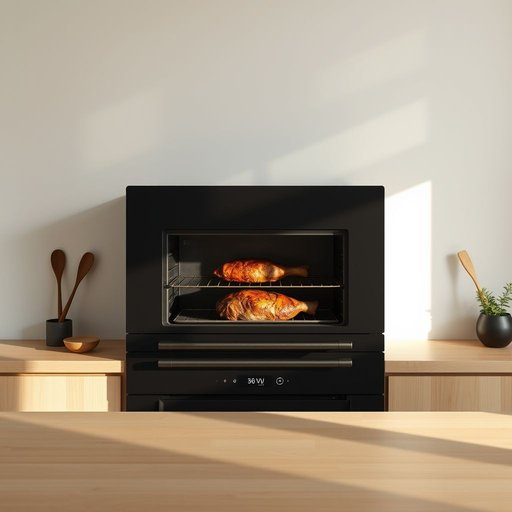

# oven

<h1 style="font-size: 2.5em; font-weight: 300; letter-spacing: 2px; margin: 0; color: #2c3e50;">
/ˈəvən/
</h1>

---

---

## 例句

Before you put the roast in the oven, ensure the seasoning enhances the flavor while the oven’s precise temperature controls prevent the meat from being overcooked on the outside yet undercooked inside.

*Before(/ˌbiˈfɔr/) you(/ju/) put(/pʊt/) the(/ðə/) roast(/roʊst/) in(/ɪn/) the(/ðə/) oven,(/ˈəvən,/) ensure(/ɪnˈʃʊr/) the(/ðə/) seasoning(/ˈsizənɪŋ/) enhances(/ɛnˈhænsɪz/) the(/ðə/) flavor(/ˈfleɪvər/) while(/waɪl/) the(/ðə/) oven’s(/oven’s*/) precise(/prɪˈsaɪs/) temperature(/ˈtɛmpərəʧər/) controls(/kənˈtroʊlz/) prevent(/prɪˈvɛnt/) the(/ðə/) meat(/mit/) from(/frəm/) being(/biɪŋ/) overcooked(/ˌoʊvərˈkʊkt/) on(/ɔn/) the(/ðə/) outside(/ˈaʊtˈsaɪd/) yet(/jɛt/) undercooked(/əndərˈkʊkt/) inside.(/ˌɪnˈsaɪd./)*

**翻译：** 在将烤肉放入烤箱之前，务必确保调味能够提升风味，同时精准的烤箱温度控制可防止肉外焦内生。

---

## 解释

英语单词“oven”作为名词，在家居生活用品的语境中主要指用于烹饪和加热食物的设备，通常是厨房中的烤箱或炉内的加热空间，适用于烘焙、烤制以及其他加热料理。具体使用场合包括描述厨房设备、食谱步骤或日常饮食准备时，如“preheat the oven”（预热烤箱），“bake in the oven”（在烤箱中烘焙）。学习者需要注意“oven”通常作为可数名词使用，复数形式为“ovens”，且常与介词短语搭配，如“in the oven”，“out of the oven”；动词“to oven”很少单独使用，更常见的表达是动词加介词，如“oven-bake”。此外，“oven”在组合词中常见如“microwave oven”（微波炉），“convection oven”（对流烤箱），学习时要关注这些常用搭配的意义和用法。词源上，“oven”源自古英语“ofen”，与荷兰语“oven”和德语“Ofen”同源，最初指代用于加热和烘烤的陶制或砖砌设备，反映了人类早期烹饪方式的发展。中文里“oven”通常准确翻译为“烤箱”或“烤炉”，强调其功能性，区别于“炉子”、“灶台”等其他厨房设备；在日常生活中该词中性无褒贬含义，但在文化背景下，西方家庭常见烤箱作为厨房重要设备，反映现代家庭烹饪习惯。总的来说，掌握“oven”的基本用法、常见搭配及背景，有助于英语学习者准确理解和应用该词于相关生活场景。

---

<small style="color: #999; font-size: 0.9em;">2025-07-17 06:22:40</small>

