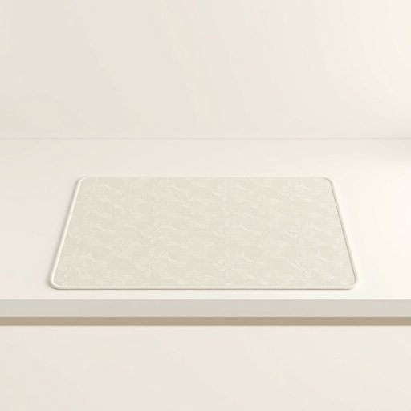

# pad

<h1 style="font-size: 2.5em; font-weight: 300; letter-spacing: 2px; margin: 0; color: #2c3e50;">
/pæd/
</h1>

---

---

## 例句

Could you please pass me the heat-resistant pad from the kitchen drawer, the one with the floral pattern that Mum bought last summer, because I’m about to take the casserole out of the oven and don’t want to risk burning the countertop?

*Could(/kʊd/) you(/ju/) please(/pliz/) pass(/pæs/) me(/mi/) the(/ðə/) heat-resistant(/heat-resistant*/) pad(/pæd/) from(/frəm/) the(/ðə/) kitchen(/ˈkɪʧən/) drawer,(/drɔr,/) the(/ðə/) one(/wən/) with(/wɪθ/) the(/ðə/) floral(/ˈflɔrəl/) pattern(/ˈpætərn/) that(/ðət/) Mum(/məm/) bought(/bɔt/) last(/læst/) summer,(/ˈsəmər,/) because(/bɪˈkəz/) I’m(/i’m*/) about(/əˈbaʊt/) to(/tɪ/) take(/teɪk/) the(/ðə/) casserole(/ˈkæsərˌoʊl/) out(/aʊt/) of(/əv/) the(/ðə/) oven(/ˈəvən/) and(/ənd/) don’t(/don’t*/) want(/wɔnt/) to(/tɪ/) risk(/rɪsk/) burning(/ˈbərnɪŋ/) the(/ðə/) countertop?(/ˈkaʊntərˌtɑp?/)*

**翻译：** 你能把厨房抽屉里那个带花纹的耐热垫递给我吗？就是妈妈去年夏天买的那个，因为我正准备把砂锅从烤箱里取出来，不想弄伤台面。

---

## 解释

英语单词“pad”作为家居生活用品中的名词，通常指垫子、护垫、衬垫等软性物品，用于增加舒适感、防止磨损或保护表面，具体使用场合包括桌面垫如写字垫、餐垫，椅子垫，地垫，锅垫或清洁用的抹布垫等。在语法上，“pad”作为可数名词时需要与冠词连用，如a pad、the pad，也可用作复数形式pads，常见的搭配有“mouse pad”（鼠标垫）、“seat pad”（座垫）、“kitchen pad”（厨房垫）等，表达时可根据具体物品前后修饰词灵活调整。需注意该词在不同搭配中意义可能略有差异，不宜直接与某些电子或文具用品混淆。词源方面，“pad”源自古英语“pæd”，最初指填充物或软垫，与现代用法保持一致，体现出其作为缓冲保护物的核心含义。在中文语境中，“pad”应根据具体用途译为“垫子”、“护垫”、“衬垫”或“垫板”，强调其实用性和柔软性，无明显褒贬色彩，但在非正式口语或俚语中“pad”也有“住所”之意，在家居用品语境下则不涉及此义，学习者应根据语境灵活翻译和使用，避免混淆。

---

<small style="color: #999; font-size: 0.9em;">2025-07-17 06:22:40</small>

