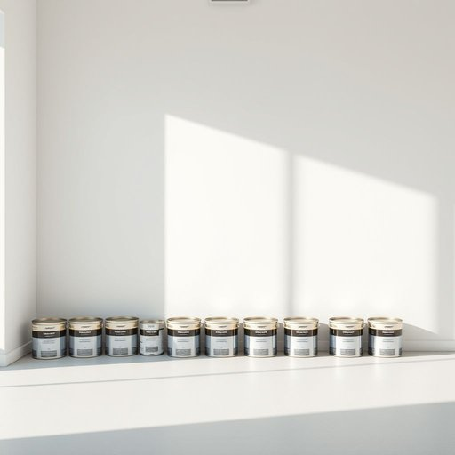

# paint

<h1 style="font-size: 2.5em; font-weight: 300; letter-spacing: 2px; margin: 0; color: #2c3e50;">
/peɪnt/
</h1>

---

---

## 例句

Before the redecorating of the living room, the paint in the garage, specifically the leftover white paint from the kitchen project, ensured a consistent finish without patches.

*Before(/ˌbiˈfɔr/) the(/ðə/) redecorating(/riˈdɛkərˌeɪtɪŋ/) of(/əv/) the(/ðə/) living(/ˈlɪvɪŋ/) room,(/rum,/) the(/ðə/) paint(/peɪnt/) in(/ɪn/) the(/ðə/) garage,(/gərɑʒ,/) specifically(/spəˈsɪfɪkli/) the(/ðə/) leftover(/ˈlɛfˌtoʊvər/) white(/waɪt/) paint(/peɪnt/) from(/frəm/) the(/ðə/) kitchen(/ˈkɪʧən/) project,(/ˈprɑʤɛkt,/) ensured(/ɪnˈʃʊrd/) a(/ə/) consistent(/kənˈsɪstənt/) finish(/ˈfɪnɪʃ/) without(/wɪˈθaʊt/) patches.(/ˈpæʧɪz./)*

**翻译：** 在重新装饰客厅之前，车库里的油漆，尤其是厨房工程剩下的白漆，保证了涂层的一致性，没有出现色差。

---

## 解释

英语单词“paint”在家居生活用品语境中作为名词，主要指用来涂刷墙壁、家具、门窗等表面的液体颜料，通常为彩色，有助于美化和保护物体表面。具体使用场合包括装修房屋、翻新家具或DIY装饰项目中，如“一罐油漆”、 “墙漆”等。英语学习者在使用“paint”作为名词时需注意它不可数时指油漆这种物质本身，但也可以加复数形式“paints”指多种颜色的颜料。此外，常见搭配有“油漆刷”、“滚筒刷”、“油漆颜色”等，表达时要区分“paint”作为名词与作为动词“to paint”涂刷动作的区别。“Paint”一词源自拉丁语“pingere”，意为“涂、画”，经过中古英语演变而来，体现了自古以来人类用于装饰和保护物品的传统工艺。在中文语境中，“paint”作为名词对应的准确翻译通常是“油漆”或“涂料”，强调它作为一种家居装饰材料的功能和物质属性，无特殊褒贬含义，但需要根据具体品种如乳胶漆、木器漆等选择恰当词汇，以避免理解误差。整体而言，“paint”在家庭生活中是一个实用且中性的词汇，使用时需结合具体语境确定其物理形态和用途。

---

<small style="color: #999; font-size: 0.9em;">2025-07-17 06:22:40</small>

