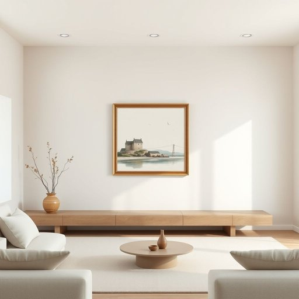

# painting

<h1 style="font-size: 2.5em; font-weight: 300; letter-spacing: 2px; margin: 0; color: #2c3e50;">
/ˈpeɪnɪŋ/
</h1>

---

---

## 例句

I was thinking that the painting hanging in the living room, which my grandmother bought during her trip to Cornwall and has been carefully preserved in its ornate frame, would perfectly complement the new colour scheme we’re planning to introduce next month.

*I(/aɪ/) was(/wɑz/) thinking(/ˈθɪŋkɪŋ/) that(/ðət/) the(/ðə/) painting(/ˈpeɪnɪŋ/) hanging(/ˈhæŋɪŋ/) in(/ɪn/) the(/ðə/) living(/ˈlɪvɪŋ/) room,(/rum,/) which(/wɪʧ/) my(/maɪ/) grandmother(/ˈgrændˌməðər/) bought(/bɔt/) during(/ˈdʊrɪŋ/) her(/hər/) trip(/trɪp/) to(/tɪ/) Cornwall(/ˈkɔrnwɔl/) and(/ənd/) has(/həz/) been(/bɪn/) carefully(/ˈkɛrfəli/) preserved(/prɪˈzərvd/) in(/ɪn/) its(/ɪts/) ornate(/ɔrˈneɪt/) frame,(/freɪm,/) would(/wʊd/) perfectly(/ˈpərfəktli/) complement(/ˈkɑmpləmənt/) the(/ðə/) new(/nu/) colour(/ˈkələr/) scheme(/skim/) we’re(/we’re*/) planning(/ˈplænɪŋ/) to(/tɪ/) introduce(/ˌɪntrəˈdus/) next(/nɛkst/) month.(/mənθ./)*

**翻译：** 我在想，挂在客厅里的那幅画，是我祖母在她去康沃尔旅行时买的，一直被精心收藏在华丽的画框中，完全能够与我们计划下个月引入的新配色方案相得益彰。

---

## 解释

英语单词"painting"在家居生活用品场景中作为名词，通常指挂在墙上用来装饰室内环境的图画或艺术作品，如油画、水彩画等，常见于客厅、卧室或书房等空间，用以提升家居美感和文化氛围。英语学习者在使用"painting"时需注意，它作为可数名词时复数形式为"paintings"，且常与定冠词"the"或指示代词"this/that"搭配，如"a beautiful painting"（一幅美丽的画）或"the painting on the wall"（墙上的那幅画）。此外，"painting"也可指绘画行为，但在家居用品语境中一般特指成品艺术作品，区分语义非常重要。词源方面，"painting"来源于中古英语"painten"，继承自拉丁语"pingere"（涂色、绘画），体现了其绘制色彩和图像的本质意义。在中文语境中，"painting"应准确译为“画作”或“绘画作品”，强调其作为装饰物或艺术品的属性，避免误解为“油漆”或“涂料”等。该词本身无贬义或特殊色彩，通常带有审美和艺术价值的文化内涵，是提升家居格调的典型用品表达。

---

<small style="color: #999; font-size: 0.9em;">2025-07-17 06:22:40</small>

