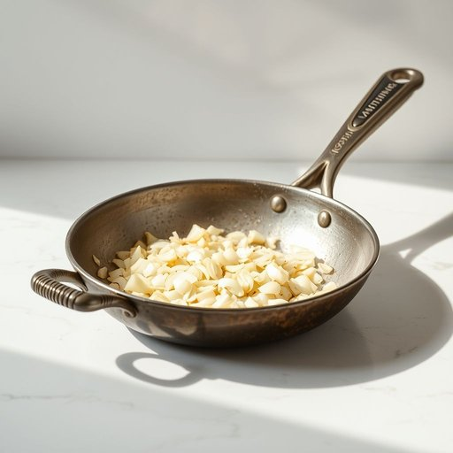

# pan

<h1 style="font-size: 2.5em; font-weight: 300; letter-spacing: 2px; margin: 0; color: #2c3e50;">
/pæn/
</h1>

---

---

## 例句

Could you please place the frying pan with the worn handle on the stove so I can sauté the onions for tonight’s dinner?

*Could(/kʊd/) you(/ju/) please(/pliz/) place(/pleɪs/) the(/ðə/) frying(/fraɪɪŋ/) pan(/pæn/) with(/wɪθ/) the(/ðə/) worn(/wɔrn/) handle(/ˈhændəl/) on(/ɔn/) the(/ðə/) stove(/stoʊv/) so(/soʊ/) I(/aɪ/) can(/kən/) sauté(/sauté*é/) the(/ðə/) onions(/ˈənjənz/) for(/fər/) tonight’s(/tonight’s*/) dinner?(/ˈdɪnər?/)*

**翻译：** 请您将那个把手磨损的煎锅放到炉子上，好让我为今晚的晚餐炒洋葱。

---

## 解释

英语单词“pan”作为名词在家居生活用品语境中通常指的是一种平底锅或煎锅，用于在炉灶上煎、炒、炸食物，具体使用场合包括烹饪时盛放和加热食材，常见于厨房环境。英语学习者在使用“pan”时需注意其语法为可数名词，单数形式是“pan”，复数为“pans”，常见搭配有“frying pan”（煎锅）、“saucepan”（调味锅或锅盖锅）、“baking pan”（烘焙盘）等，表达时可根据具体锅的用途添加前缀或修饰词以明确含义。该词源自古英语“panne”，来源于拉丁语“patina”，意指一种浅盘状器具，经历了历史演变后被用来指代厨房用具中的各类平底锅。中文语境下，“pan”通常精准翻译为“锅”或“平底锅”，理解时需结合具体类型和用途，不宜简单泛化为所有锅具，避免与“pot”（锅）混淆。在文化内涵上，“pan”作为厨房必备用具，有其实用中性意义，无褒贬色彩，但在某些习惯表达或成语中（如“to pan a movie”意指严厉批评）则有比喻用法，但在家居生活中仅指锅具时则无此色彩。

---

<small style="color: #999; font-size: 0.9em;">2025-07-17 06:22:40</small>

