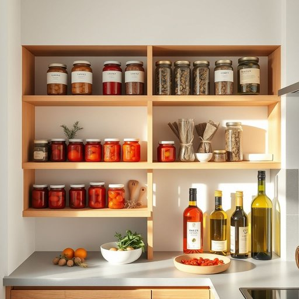

# pantry

<h1 style="font-size: 2.5em; font-weight: 300; letter-spacing: 2px; margin: 0; color: #2c3e50;">
/ˈpæntri/
</h1>

---

---

## 例句

Before preparing dinner, could you please check the pantry to see if we still have enough canned tomatoes, dried herbs, and olive oil, as I’m planning to make a rich, slow-cooked stew that requires a variety of these ingredients?

*Before(/ˌbiˈfɔr/) preparing(/pərˈpɛrɪŋ/) dinner,(/ˈdɪnər,/) could(/kʊd/) you(/ju/) please(/pliz/) check(/ʧɛk/) the(/ðə/) pantry(/ˈpæntri/) to(/tɪ/) see(/si/) if(/ɪf/) we(/wi/) still(/stɪl/) have(/hæv/) enough(/ɪˈnəf/) canned(/kænd/) tomatoes,(/təˈmɑtoʊz,/) dried(/draɪd/) herbs,(/ərbz,/) and(/ənd/) olive(/ˈɑlɪv/) oil,(/ɔɪl,/) as(/ɛz/) I’m(/i’m*/) planning(/ˈplænɪŋ/) to(/tɪ/) make(/meɪk/) a(/ə/) rich,(/rɪʧ,/) slow-cooked(/slow-cooked*/) stew(/stu/) that(/ðət/) requires(/rikˈwaɪərz/) a(/ə/) variety(/vərˈaɪəti/) of(/əv/) these(/ðiz/) ingredients?(/ˌɪnˈgridiənts?/)*

**翻译：** 在准备晚餐之前，能否请你检查一下储藏室，看看我们是否还有足够的罐装番茄、干香草和橄榄油？我打算做一道浓郁的慢炖炖菜，需要用到这些多种食材。

---

## 解释

英语名词“pantry”在家居生活用品的语境中，指的是用来存放食品、厨房用品或餐具的小储藏室或橱柜，通常位于厨房附近或与厨房相连，用于保持食材干燥、有序和便于取用。具体使用场合多见于家庭、餐厅或食品供应环境中，当谈论储存罐头、干货、调味料、餐具等时常用该词。学习者需注意“pantry”作为可数名词，其复数形式为“pantries”，常见搭配有“a pantry shelf”（储藏架）、“a walk-in pantry”（可进人的储藏室）、“stock the pantry”（储备食品）等表达，此外，“pantry”通常以单数形式出现指代整个储藏空间。词源方面，“pantry”源自中古英语“paneterie”，意为专门储藏面包和食品的地方，进一步源自古法语“paneterie”，根源与拉丁语“panis”（面包）相关，显示其与食物储存的紧密联系。在中文语境中，“pantry”一般准确译为“储藏室”或“食品储藏室”，有时按具体情况译为“食品橱”或“储粮室”，反映其主要功能是食物存放，而非普通衣物或杂物的储藏。该词在使用中无明显褒贬色彩，属于中性词汇，但在现代家居描述中带有一定生活便利和整洁的积极含义，暗示居家环境的有序和厨务管理的完善。

---

<small style="color: #999; font-size: 0.9em;">2025-07-17 06:22:40</small>

