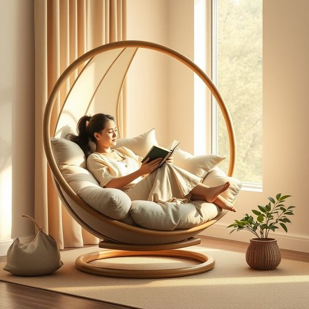

# papasan

<h1 style="font-size: 2.5em; font-weight: 300; letter-spacing: 2px; margin: 0; color: #2c3e50;">
/papasan*/
</h1>

---

---

## 例句

After spending an exhausting day tidying up the living room, she finally sank into the oversized papasan, whose plush cushions and enveloping circular frame, carefully positioned by the window to catch the afternoon sun, made it the perfect spot not only for reading her favourite novel but also for momentarily escaping the chaos of everyday life.

*After(/ˈæftər/) spending(/ˈspɛndɪŋ/) an(/ən/) exhausting(/ɪgˈzɔstɪŋ/) day(/deɪ/) tidying(/tidying*/) up(/əp/) the(/ðə/) living(/ˈlɪvɪŋ/) room,(/rum,/) she(/ʃi/) finally(/ˈfaɪnəli/) sank(/sæŋk/) into(/ˈɪntu/) the(/ðə/) oversized(/ˈoʊvərˌsaɪzd/) papasan,(/papasan*,/) whose(/huz/) plush(/pləʃ/) cushions(/ˈkʊʃənz/) and(/ənd/) enveloping(/ɪnˈvɛləpɪŋ/) circular(/ˈsərkjələr/) frame,(/freɪm,/) carefully(/ˈkɛrfəli/) positioned(/pəˈzɪʃənd/) by(/baɪ/) the(/ðə/) window(/ˈwɪndoʊ/) to(/tɪ/) catch(/kæʧ/) the(/ðə/) afternoon(/ˌæftərˈnun/) sun,(/sən,/) made(/meɪd/) it(/ɪt/) the(/ðə/) perfect(/ˈpərˌfɪkt/) spot(/spɑt/) not(/nɑt/) only(/ˈoʊnli/) for(/fər/) reading(/ˈrɛdɪŋ/) her(/hər/) favourite(/ˈfeɪvərɪt/) novel(/ˈnɑvəl/) but(/bət/) also(/ˈɔlsoʊ/) for(/fər/) momentarily(/ˌmoʊmənˈtɛrəli/) escaping(/ɪˈskeɪpɪŋ/) the(/ðə/) chaos(/keɪɑs/) of(/əv/) everyday(/ˈɛvriˈdeɪ/) life.(/laɪf./)*

**翻译：** 在经历了一天疲惫的整理客厅之后，她终于沉入那张超大号的帕帕桑椅中。椅子柔软的靠垫和环抱式的圆形框架被精心摆放在窗边，沐浴着午后的阳光，使这里不仅成为阅读她最喜欢小说的理想之地，更是暂时逃离日常纷扰的完美空间。

---

## 解释

“papasan”作为名词主要指一种宽大、舒适、通常配有厚垫子的圆形吊椅或扶手椅，多见于家居生活用品的语境中，常用于描述休闲区、阳台或客厅中放置的家具。英语学习者使用时需注意，该词通常不可数，单数形式为“papasan”，复数形式为“papasans”，常用搭配包括“papasan chair”、“a comfortable papasan”，表达时可突出其休闲和舒适属性。语法上，它作为可数名词用作主语、宾语等，无特殊变形或复杂用法。词源方面，“papasan”来源于菲律宾语，原指一种当地的椅子，20世纪中期被引入欧美家居市场，因其柔软舒适的设计而获得流行。中文语境中，“papasan”准确翻译为“吊椅”或“圆形休闲椅”，强调其圆盘形状和舒适的坐感，亦可称为“巴帕桑椅”。该词本身无褒贬色彩，更偏向描述性，体现一种轻松、休闲的生活方式，适合营造温馨、随意的居家氛围。

---

<small style="color: #999; font-size: 0.9em;">2025-07-17 06:22:40</small>

