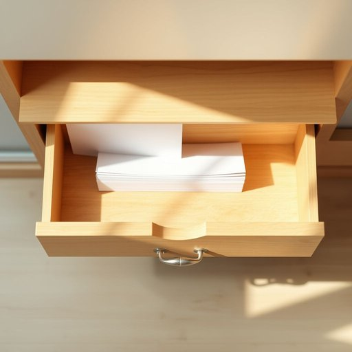

# paper

<h1 style="font-size: 2.5em; font-weight: 300; letter-spacing: 2px; margin: 0; color: #2c3e50;">
/ˈpeɪpər/
</h1>

---

---

## 例句

Could you please check if there is any clean paper left in the drawer, as I need to jot down a few notes about the gardening schedule and the upcoming bills, but I would rather not waste any of the fancy stationery we usually keep for special occasions?

*Could(/kʊd/) you(/ju/) please(/pliz/) check(/ʧɛk/) if(/ɪf/) there(/ðɛr/) is(/ɪz/) any(/ˈɛni/) clean(/klin/) paper(/ˈpeɪpər/) left(/lɛft/) in(/ɪn/) the(/ðə/) drawer,(/drɔr,/) as(/ɛz/) I(/aɪ/) need(/nid/) to(/tɪ/) jot(/ʤɑt/) down(/daʊn/) a(/ə/) few(/fju/) notes(/noʊts/) about(/əˈbaʊt/) the(/ðə/) gardening(/ˈgɑrdənɪŋ/) schedule(/ˈskɛʤʊl/) and(/ənd/) the(/ðə/) upcoming(/ˈəpˌkəmɪŋ/) bills,(/bɪlz,/) but(/bət/) I(/aɪ/) would(/wʊd/) rather(/ˈrəðər/) not(/nɑt/) waste(/weɪst/) any(/ˈɛni/) of(/əv/) the(/ðə/) fancy(/ˈfænsi/) stationery(/ˈsteɪʃəˌnɛri/) we(/wi/) usually(/ˈjuʒəwəli/) keep(/kip/) for(/fər/) special(/ˈspɛʃəl/) occasions?(/ɔˈkeɪʒənz?/)*

**翻译：** 请帮我看看抽屉里是否还有干净的纸张，我需要记下几条关于园艺安排和即将到期账单的笔记，但我不想浪费我们平时留作特殊场合使用的那些精美文具。

---

## 解释

英语单词“paper”作为名词在家居生活用品的语境中，通常指的是用于书写、打印、包裹或清洁等功能的纸质材料，如打印纸、卫生纸、纸巾或包装纸等。具体使用场合包括写作或复印时的纸张、厨房或浴室使用的纸巾、包裹物品的包装纸等，这些都是日常家居生活中常见的“paper”类别。英语学习者在使用“paper”时需注意它作为不可数名词和可数名词的区分：通常指纸这种材质时不可数，如“I need some paper”；指具体的一张或一份纸时可数，如“a paper”表示一张纸或一篇论文。此外，“paper”常见的搭配有“write on paper”（在纸上写），“a sheet of paper”（一张纸），“paper towel”（纸巾），“toilet paper”（卫生纸）等，熟悉这些搭配有助于准确表达和理解。词源方面，“paper”源自拉丁语“papyrus”，这种古代埃及用于书写的植物纸，后来演变为现代英语中表示纸张的词汇。中文语境中，“paper”在家居生活用品范畴准确翻译为“纸”或根据具体种类称为“纸张”、“卫生纸”、“纸巾”等，强调的是其材质和用途。需要注意的是，虽然“paper”在多数情况下为中性词，但在特定语境中可能带有雅致或正式的色彩，如书面文件或学术论文，但在家居用品场景中通常无褒贬含义，属于日常常见物品，文化内涵较为中性。

---

<small style="color: #999; font-size: 0.9em;">2025-07-17 06:22:40</small>

