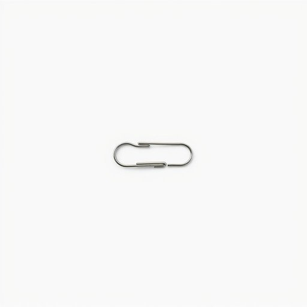

# paperclip

<h1 style="font-size: 2.5em; font-weight: 300; letter-spacing: 2px; margin: 0; color: #2c3e50;">
/paperclip*/
</h1>

---

---

## 例句

Could you please check the drawer where the stationery is kept, as the organisation of the box containing colourful paperclips seems to have caused the misplacement of a single paperclip needed to fasten the receipts together?

*Could(/kʊd/) you(/ju/) please(/pliz/) check(/ʧɛk/) the(/ðə/) drawer(/drɔr/) where(/wɛr/) the(/ðə/) stationery(/ˈsteɪʃəˌnɛri/) is(/ɪz/) kept,(/kɛpt,/) as(/ɛz/) the(/ðə/) organisation(/ˌɔrgənɪˈzeɪʃən/) of(/əv/) the(/ðə/) box(/bɑks/) containing(/kənˈteɪnɪŋ/) colourful(/colourful*/) paperclips(/paperclips*/) seems(/simz/) to(/tɪ/) have(/hæv/) caused(/kɔzd/) the(/ðə/) misplacement(/misplacement*/) of(/əv/) a(/ə/) single(/ˈsɪŋgəl/) paperclip(/paperclip*/) needed(/ˈnidɪd/) to(/tɪ/) fasten(/ˈfæsən/) the(/ðə/) receipts(/rɪˈsits/) together?(/təˈgɛðər?/)*

**翻译：** 请您检查一下放置文具的抽屉，似乎因为装彩色回形针的盒子摆放不当，导致一枚用于固定收据的回形针遗失了。

---

## 解释

英语单词“paperclip”作为名词，指的是一种家居生活和办公环境中常见的小型金属夹，用于将多张纸张固定在一起，常见于家庭、学校和办公室中帮助整理文件。具体使用场合通常是涉及文具、文件归类或临时固定纸张的情境，如“Please use a paperclip to keep these pages together”（请用回形针把这些页夹在一起）。英语学习者在使用“paperclip”时要注意该词作为可数名词，其复数形式是“paperclips”，常见搭配包括“a paperclip”、“some paperclips”或描述其功能时用动词短语如“attach with a paperclip”。此外，作为具体物品名称，其语法非常直接，通常在句中作主语或宾语无复杂变化。词源方面，“paperclip”由“paper”（纸）和“clip”（夹子）合成而来，最早出现在19世纪末，反映发明初期单纯的功能性命名。中文语境中“paperclip”准确翻译为“回形针”，该词无褒贬色彩，属于中性词汇，是文具类别中极为常见和实用的工具，此外“回形针”一词在汉语中也因其造型类似回形而得名，使用时需注意区别于其他类型的夹子或订书钉，以免混淆。在文化内涵上，“paperclip”偶尔被用作比喻，比如形容某物小巧简单，但整体上并无特殊的文化象征或隐含意义。

---

<small style="color: #999; font-size: 0.9em;">2025-07-17 06:22:40</small>

