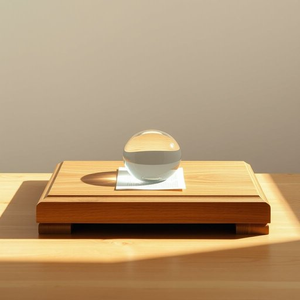

# paperweight

<h1 style="font-size: 2.5em; font-weight: 300; letter-spacing: 2px; margin: 0; color: #2c3e50;">
/ˈpeɪpərˌweɪt/
</h1>

---

---

## 例句

Although the autumn breeze was gentle enough to keep the curtains from billowing wildly, I still placed the antique glass paperweight, which my grandmother had gifted me during her last visit, on top of the scattered bills and letters to prevent them from fluttering off the polished oak desk, where I usually sort through paperwork amidst the cozy clutter of my home study.

*Although(/ˌɔlˈðoʊ/) the(/ðə/) autumn(/ˈɔtəm/) breeze(/briz/) was(/wɑz/) gentle(/ˈʤɛnəl/) enough(/ɪˈnəf/) to(/tɪ/) keep(/kip/) the(/ðə/) curtains(/ˈkərtənz/) from(/frəm/) billowing(/ˈbɪloʊɪŋ/) wildly,(/ˈwaɪldli,/) I(/aɪ/) still(/stɪl/) placed(/pleɪst/) the(/ðə/) antique(/ænˈtik/) glass(/glæs/) paperweight,(/ˈpeɪpərˌweɪt,/) which(/wɪʧ/) my(/maɪ/) grandmother(/ˈgrændˌməðər/) had(/hæd/) gifted(/ˈgɪftɪd/) me(/mi/) during(/ˈdʊrɪŋ/) her(/hər/) last(/læst/) visit,(/ˈvɪzɪt,/) on(/ɔn/) top(/tɔp/) of(/əv/) the(/ðə/) scattered(/ˈskætərd/) bills(/bɪlz/) and(/ənd/) letters(/ˈlɛtərz/) to(/tɪ/) prevent(/prɪˈvɛnt/) them(/ðɛm/) from(/frəm/) fluttering(/ˈflətərɪŋ/) off(/ɔf/) the(/ðə/) polished(/ˈpɑlɪʃt/) oak(/oʊk/) desk,(/dɛsk,/) where(/wɛr/) I(/aɪ/) usually(/ˈjuʒəwəli/) sort(/sɔrt/) through(/θru/) paperwork(/ˈpeɪpərˌwərk/) amidst(/əˈmɪdst/) the(/ðə/) cozy(/ˈkoʊzi/) clutter(/ˈklətər/) of(/əv/) my(/maɪ/) home(/hoʊm/) study.(/ˈstədi./)*

**翻译：** 虽然秋风轻柔，不至于让窗帘剧烈摆动，但我仍将奶奶上次来访时赠予我的那枚古董玻璃镇纸压在散落的账单和信件上，以防它们被吹离我那张光滑的橡木书桌。这张桌子是我平日里在家中书房里，伴随着温馨杂乱的环境，整理各种文件的地方。

---

## 解释

单词“paperweight”在家居生活用品的语境中作为名词，指的是一种用来压住纸张防止其被风吹散的小型装饰性物品，通常放置在书桌、办公桌或家里的书房等场所。使用时，常见的表达有“a glass paperweight”（玻璃纸镇）、“a decorative paperweight”（装饰性纸镇）等，需要注意的是“paperweight”作为可数名词，复数形式为“paperweights”，在句中通常作主语、宾语或表语。英语学习者应注意其复合词性质，由“paper”（纸）和“weight”（重物）组成，明确其在句中功能和数的变化。词源上，“paperweight”源于19世纪末用于描述那种用来压纸的重物，最初强调其实用性，后来逐渐演变为既实用又具装饰性的物件，尤其在文具和礼品市场中广泛出现。在中文语境中，“paperweight”准确翻译为“纸镇”或“镇纸”，这是一个中性词汇，没有褒贬含义，指代的物品多为透明玻璃、水晶或其他材料制成，具有一定的观赏价值和实用功能，文化上常与文房四宝的书写辅助工具相类比，体现了一种书写和办公环境中的雅致和秩序感。

---

<small style="color: #999; font-size: 0.9em;">2025-07-17 06:22:40</small>

