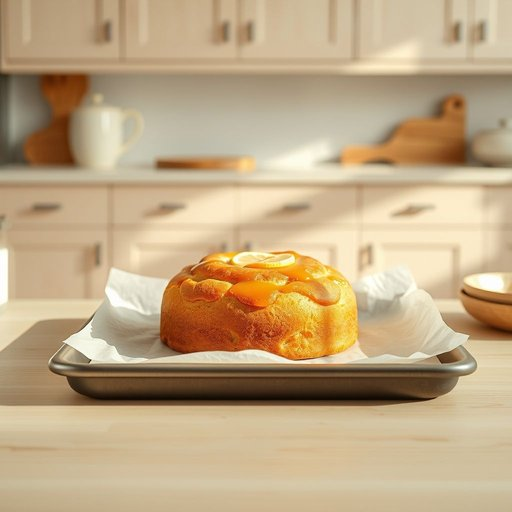

# parchment

<h1 style="font-size: 2.5em; font-weight: 300; letter-spacing: 2px; margin: 0; color: #2c3e50;">
/ˈpɑrʧmənt/
</h1>

---

---

## 例句

Before baking the batch of lemon drizzle cakes, the parchment is essential to line the trays properly, ensuring the cakes do not stick and the texture remains perfect.

*Before(/ˌbiˈfɔr/) baking(/ˈbeɪkɪŋ/) the(/ðə/) batch(/bæʧ/) of(/əv/) lemon(/ˈlɛmən/) drizzle(/ˈdrɪzəl/) cakes,(/keɪks,/) the(/ðə/) parchment(/ˈpɑrʧmənt/) is(/ɪz/) essential(/ɛˈsɛnʃəl/) to(/tɪ/) line(/laɪn/) the(/ðə/) trays(/treɪz/) properly,(/ˈprɑpərli,/) ensuring(/ɪnˈʃʊrɪŋ/) the(/ðə/) cakes(/keɪks/) do(/du/) not(/nɑt/) stick(/stɪk/) and(/ənd/) the(/ðə/) texture(/ˈtɛksʧər/) remains(/rɪˈmeɪnz/) perfect.(/ˈpərˌfɪkt./)*

**翻译：** 在烤制一批柠檬淋酱蛋糕之前，铺好烤盘纸是必不可少的，这样可以确保蛋糕不会粘底，口感保持完美。

---

## 解释

英语单词“parchment”作为名词在家居生活用品的语境中，通常指用于烹饪的“烘焙纸”或“羊皮纸”，这是一种耐高温的不粘纸，常用于烤盘垫底防止食物粘连，方便清洁。其具体使用场合多见于厨房场景，如烤箱烘焙蛋糕、烤鱼、包裹食物等，属于烹饪辅助材料而非传统书写的羊皮纸。“parchment”作为名词复数形式是“parchments”，但在描述家用烘焙纸时通常不用复数。学习者需注意，“parchment”除了指烘焙纸，也有历史上用于书写的羊皮纸含义，语境不同词义差异明显，需根据上下文辨别。此外，“parchment paper”或“baking parchment”是其常见搭配词组，形容具体用途时更精确；“parchment”单独用时更偏向传统材料含义。词源上，“parchment”源自中世纪拉丁语“pergamena”，意指源自帕加马（Pergamon）地区的羊皮纸，这种纸张起初用于古籍书写，后因工艺发展演变出多种用途。在中文语境中，“parchment”应根据具体情况翻译为“烘焙纸”或“羊皮纸”，准确理解其功能属性尤为重要。该词本身无明显褒贬含义，文化色彩较为中性，但在历史文化语境下一般与古文献、传统书写材料相关联，具有一定的文化厚重感。

---

<small style="color: #999; font-size: 0.9em;">2025-07-17 06:22:40</small>

