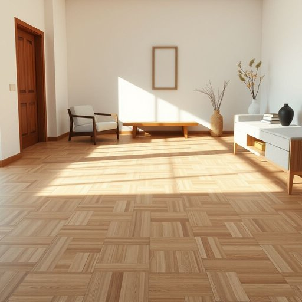

# parquet

<h1 style="font-size: 2.5em; font-weight: 300; letter-spacing: 2px; margin: 0; color: #2c3e50;">
/pɑrˈkeɪ/
</h1>

---

---

## 例句

After carefully inspecting the intricate patterns of the aged parquet in the living room, which had been painstakingly restored last summer to preserve its original charm, she decided that installing additional rugs would not only protect the delicate wooden surface from scratches caused by the children’s toys but also add a cozy touch to the otherwise pristine floor.

*After(/ˈæftər/) carefully(/ˈkɛrfəli/) inspecting(/ˌɪnˈspɛktɪŋ/) the(/ðə/) intricate(/ˈɪntrəkət/) patterns(/ˈpætərnz/) of(/əv/) the(/ðə/) aged(/ˈeɪʤɪd/) parquet(/pɑrˈkeɪ/) in(/ɪn/) the(/ðə/) living(/ˈlɪvɪŋ/) room,(/rum,/) which(/wɪʧ/) had(/hæd/) been(/bɪn/) painstakingly(/ˈpeɪnˌsteɪkɪŋli/) restored(/rɪˈstɔrd/) last(/læst/) summer(/ˈsəmər/) to(/tɪ/) preserve(/prɪˈzərv/) its(/ɪts/) original(/ərˈɪʤənəl/) charm,(/ʧɑrm,/) she(/ʃi/) decided(/ˌdɪˈsaɪdɪd/) that(/ðət/) installing(/ˌɪnˈstɔlɪŋ/) additional(/əˈdɪʃənəl/) rugs(/rəgz/) would(/wʊd/) not(/nɑt/) only(/ˈoʊnli/) protect(/prəˈtɛkt/) the(/ðə/) delicate(/ˈdɛləkət/) wooden(/ˈwʊdən/) surface(/ˈsərfəs/) from(/frəm/) scratches(/ˈskræʧɪz/) caused(/kɔzd/) by(/baɪ/) the(/ðə/) children’s(/children’s*/) toys(/tɔɪz/) but(/bət/) also(/ˈɔlsoʊ/) add(/æd/) a(/ə/) cozy(/ˈkoʊzi/) touch(/təʧ/) to(/tɪ/) the(/ðə/) otherwise(/ˈəðərˌwaɪz/) pristine(/ˈprɪstin/) floor.(/flɔr./)*

**翻译：** 在仔细检查了客厅那块去年夏天经过精心修复以保持其原有魅力的陈旧镶木地板上错综复杂的纹理后，她决定铺设更多的地毯，这不仅能保护这层易受儿童玩具刮擦的细腻木质表面，还能为本已洁净的地板增添一抹温馨的气息。

---

## 解释

英语单词“parquet”作为名词，在家居生活用品语境中指的是一种由小块木板（通常是硬木）按照特定几何图案镶嵌铺设的地板，常见于客厅、走廊或其他室内空间，强调视觉美感和工艺细节。使用时，“parquet”常搭配定冠词the，如“the parquet floor”或直接作为复合名词“parquet flooring”，表达铺有拼花木地板的地面。学习者需要注意，parquet作为不可数名词时通常指整体铺装的木地板，而作为可数名词则多指小方块木板本身。语法上，它通常作为名词使用，不能直接用作动词。词源来自法语“parquet”，原意是“围栏”，后来引申为“木地板”，源自中古法语，体现了从围栏结构到木板镶嵌的演变。中文中“parquet”一般译为“镶木地板”或“拼花地板”，强调其装饰性和结构性，与普通实木地板相比更具艺术感和层次感。该词没有明显褒贬色彩，更多体现的是一种高档住宅或传统欧式装修中注重细节和优雅的室内设计风格，因此在使用时也带有一定的文化品味暗示。

---

<small style="color: #999; font-size: 0.9em;">2025-07-17 06:22:40</small>

