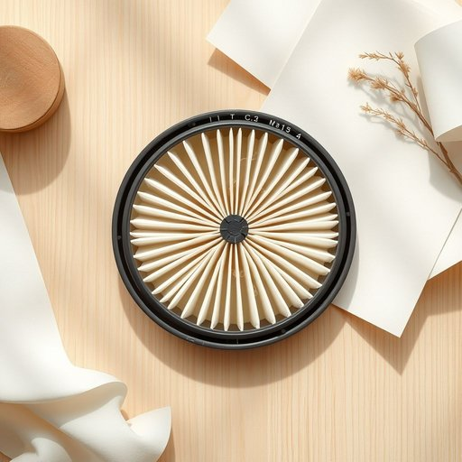

# part

<h1 style="font-size: 2.5em; font-weight: 300; letter-spacing: 2px; margin: 0; color: #2c3e50;">
/pɑrt/
</h1>

---

---

## 例句

The vacuum cleaner’s filter, which often collects dust and hair, requires regular inspection and cleaning to maintain optimal performance and prevent loss of suction power.

*The(/ðə/) vacuum(/ˈvækjum/) cleaner’s(/cleaner’s*/) filter,(/ˈfɪltər,/) which(/wɪʧ/) often(/ˈɔfən/) collects(/kəˈlɛkts/) dust(/dəst/) and(/ənd/) hair,(/hɛr,/) requires(/rikˈwaɪərz/) regular(/ˈrɛgjələr/) inspection(/ˌɪnˈspɛkʃən/) and(/ənd/) cleaning(/ˈklinɪŋ/) to(/tɪ/) maintain(/meɪnˈteɪn/) optimal(/ˈɑptɪməl/) performance(/pərˈfɔrməns/) and(/ənd/) prevent(/prɪˈvɛnt/) loss(/lɔs/) of(/əv/) suction(/ˈsəkʃən/) power.(/paʊər./)*

**翻译：** 吸尘器的滤网经常积聚灰尘和毛发，需要定期检查和清洁，以保持最佳性能，防止吸力下降。

---

## 解释

在家居生活用品的语境中，英语单词“part”作为名词通常指的是组成某物的“部件”或“零件”，例如家具的螺丝、抽屉滑轨或灯具中的灯泡都可以称为“parts”，使用场合多见于说明产品结构、维修或组装过程，如“spare parts”（备用零件）或“replacement parts”（替换部件）。对于英语学习者来说，需注意“part”作为名词时通常是可数名词，复数形式为“parts”，且常与形容词连用或通过介词短语修饰，如“a part of the table”（桌子的一部分）；此外，“part”也可指“部位”或“局部”，表达整体中的某一块或某一段。使用时应区分“part”与“piece”（碎片、块）， “part”更倾向于整体中的功能部分，且常见短语还有“take part in”（参与，虽然更多作为动词短语），但在家居用品语境中主要关注其物理部件含义。词源上，“part”源自拉丁语“partem”，意为“部分、份额”，是从整体中分割出来的“部分”的抽象概念。中文中通常译为“部件”、“零件”、“部分”，在家居用品语境下强调其作为整体设备或家具的构成单元，与“整体”相对，表达的是组成意义，没有特殊褒贬含义，但在文化上体现了对产品结构和维修细节的关注，适用于技术说明、产品说明书和日常交流中对物品组成的准确描述。

---

<small style="color: #999; font-size: 0.9em;">2025-07-17 06:22:40</small>

