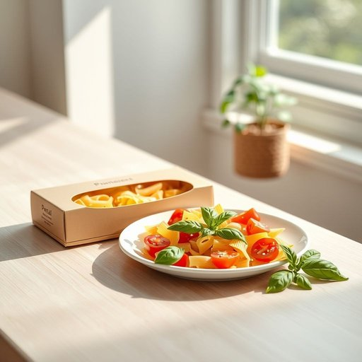

# pasta

<h1 style="font-size: 2.5em; font-weight: 300; letter-spacing: 2px; margin: 0; color: #2c3e50;">
/ˈpɑstə/
</h1>

---

---

## 例句

After rummaging through the cluttered pantry, she finally found a large, unopened box of pasta—perfect for whipping up a quick dinner alongside the freshly chopped tomatoes and aromatic basil she had just picked from the windowsill herb garden.

*After(/ˈæftər/) rummaging(/ˈrəmɪʤɪŋ/) through(/θru/) the(/ðə/) cluttered(/ˈklətərd/) pantry,(/ˈpæntri,/) she(/ʃi/) finally(/ˈfaɪnəli/) found(/faʊnd/) a(/ə/) large,(/lɑrʤ,/) unopened(/əˈnoʊpənd/) box(/bɑks/) of(/əv/) pasta—perfect(/pasta—perfect*/) for(/fər/) whipping(/ˈwɪpɪŋ/) up(/əp/) a(/ə/) quick(/kwɪk/) dinner(/ˈdɪnər/) alongside(/əˈlɔŋˈsaɪd/) the(/ðə/) freshly(/ˈfrɛʃli/) chopped(/ʧɑpt/) tomatoes(/təˈmɑtoʊz/) and(/ənd/) aromatic(/ˌɛrəˈmætɪk/) basil(/ˈbæzəl/) she(/ʃi/) had(/hæd/) just(/ʤɪst/) picked(/pɪkt/) from(/frəm/) the(/ðə/) windowsill(/windowsill*/) herb(/ərb/) garden.(/ˈgɑrdən./)*

**翻译：** 在翻遍了杂乱的储藏室后，她终于找到了一盒未开封的大包装意面——正好用来搭配刚从窗台上的香草园摘下的新鲜番茄和芳香的罗勒，迅速做出一顿晚餐。

---

## 解释

英语单词“pasta”作为名词，在家居生活用品的语境中通常指的是意大利面或各类由面粉和水制成的面食产品，常见于厨房储藏或烹饪场合，如意大利面条、通心粉、螺旋面等。在具体使用时，人们多用“pasta”指代干燥的或者新鲜的意大利面食，常见搭配包括“cook pasta”（煮意大利面）、“a box of pasta”（一盒意大利面）以及“pasta sauce”（意大利面酱），需要注意的是，它作为不可数名词时一般不用复数形式，但在口语中偶尔也会出现“pastas”指多种不同类型的面食。语法上通常作不可数名词使用，表达时侧重整体概念而非单一形态，且多与烹饪动词连用。该词源自意大利语“pasta”，意为“面团”，本身源于拉丁语“pasta”，意指由面粉和液体混合而成的面团制品，体现了其食品属性和制作工艺。在中文语境中，“pasta”准确翻译为“意大利面”，指意大利传统面食，无负面褒贬含义，更多承载的是西方饮食文化的代表，是家居厨房中常见的食品类别，体现出使用者对西餐文化的接纳与实践。

---

<small style="color: #999; font-size: 0.9em;">2025-07-17 06:22:40</small>

