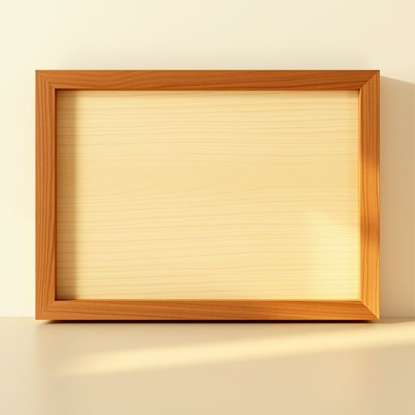

# paste

<h1 style="font-size: 2.5em; font-weight: 300; letter-spacing: 2px; margin: 0; color: #2c3e50;">
/peɪst/
</h1>

---

---

## 例句

Before you start decorating the wooden frame, make sure to choose a high-quality paste, which not only ensures better adhesion between the surfaces but also dries clear and resists cracking over time, so your handiwork remains both sturdy and visually appealing.

*Before(/ˌbiˈfɔr/) you(/ju/) start(/stɑrt/) decorating(/ˈdɛkərˌeɪtɪŋ/) the(/ðə/) wooden(/ˈwʊdən/) frame,(/freɪm,/) make(/meɪk/) sure(/ʃʊr/) to(/tɪ/) choose(/ʧuz/) a(/ə/) high-quality(/ˌhaɪkˈwɑləti/) paste,(/peɪst,/) which(/wɪʧ/) not(/nɑt/) only(/ˈoʊnli/) ensures(/ɪnˈʃʊrz/) better(/ˈbɛtər/) adhesion(/æˈdhiʒən/) between(/bɪtˈwin/) the(/ðə/) surfaces(/ˈsərfəsɪz/) but(/bət/) also(/ˈɔlsoʊ/) dries(/draɪz/) clear(/klɪr/) and(/ənd/) resists(/rɪˈzɪsts/) cracking(/ˈkrækɪŋ/) over(/ˈoʊvər/) time,(/taɪm,/) so(/soʊ/) your(/jʊr/) handiwork(/ˈhændiˌwərk/) remains(/rɪˈmeɪnz/) both(/boʊθ/) sturdy(/ˈstərdi/) and(/ənd/) visually(/ˈvɪʒwəli/) appealing.(/əˈpilɪŋ./)*

**翻译：** 在开始装饰木质框架之前，请务必选择高品质的胶水，这不仅能确保表面之间更佳的粘合效果，还能干燥透明，且随着时间推移不易开裂，使您的手工作品既坚固耐用，又赏心悦目。

---

## 解释

在家居生活用品的语境中，名词“paste”通常指一种半流质或膏状的物质，常见于牙膏、胶状物或烹饪用的酱料，如番茄酱。具体使用场合多为描述日常生活中需要涂抹或粘合的物品，如清洁口腔的牙膏或用于粘贴的糨糊。在英语学习中，作为名词的“paste”通常不可数，但在表示具体种类时也可以复数，如“toothpastes”。其常见搭配包括“toothpaste”（牙膏）、“glue paste”（胶水）、“tomato paste”（番茄酱）等，且多与表示用途的名词结合形成复合词或短语。语法上需注意，作为名词时“paste”不能直接用作动词，动词形式同样为“paste”，但含义和用法不同。词源上，“paste”源自拉丁语“pasta”，意为面团或糊状物，进入英语后逐渐泛指任何糊状或膏状物质，这体现出其在家居生活中广泛的应用范围。中文中“paste”准确的翻译多为“膏状物”、“糊状物”或根据具体产品名译为“牙膏”、“酱”或“膏”，强调其稠密且可涂抹的性质。该词通常无褒贬色彩，属于中性词汇，但在不同文化中对某些特定“paste”如药膏或调料的接受度存在差异，需结合具体语境理解其应用。

---

<small style="color: #999; font-size: 0.9em;">2025-07-17 06:22:40</small>

