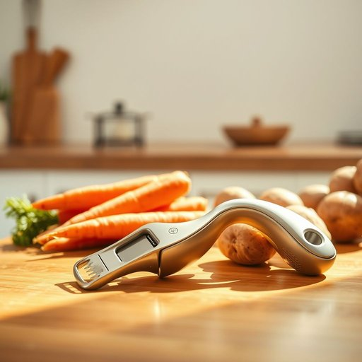

# peeler

<h1 style="font-size: 2.5em; font-weight: 300; letter-spacing: 2px; margin: 0; color: #2c3e50;">
/ˈpilər/
</h1>

---

---

## 例句

Before you start chopping the carrots and potatoes for the stew, make sure you grab the peeler from the drawer, which is the one with the comfortable grip and the sharpest blade, because using a blunt peeler can turn peeling into a frustrating, time-consuming chore.

*Before(/ˌbiˈfɔr/) you(/ju/) start(/stɑrt/) chopping(/ˈʧɑpɪŋ/) the(/ðə/) carrots(/ˈkɛrəts/) and(/ənd/) potatoes(/pəˈteɪtoʊz/) for(/fər/) the(/ðə/) stew,(/stu,/) make(/meɪk/) sure(/ʃʊr/) you(/ju/) grab(/græb/) the(/ðə/) peeler(/ˈpilər/) from(/frəm/) the(/ðə/) drawer,(/drɔr,/) which(/wɪʧ/) is(/ɪz/) the(/ðə/) one(/wən/) with(/wɪθ/) the(/ðə/) comfortable(/ˈkəmfərtəbəl/) grip(/grɪp/) and(/ənd/) the(/ðə/) sharpest(/ˈʃɑrpəst/) blade,(/bleɪd,/) because(/bɪˈkəz/) using(/ˈjuzɪŋ/) a(/ə/) blunt(/blənt/) peeler(/ˈpilər/) can(/kən/) turn(/tərn/) peeling(/ˈpilɪŋ/) into(/ˈɪntu/) a(/ə/) frustrating,(/ˈfrəˌstreɪtɪŋ,/) time-consuming(/time-consuming*/) chore.(/ʧɔr./)*

**翻译：** 在开始切胡萝卜和土豆做炖菜之前，务必先从抽屉里拿出那把握感舒适、刀刃锋利的削皮器，因为使用钝的削皮器会让剥皮变成既令人沮丧又费时的麻烦。

---

## 解释

单词“peeler”作为名词，在家居生活用品的语境中通常指的是“削皮器”或“削皮刀”，是一种专门用来去除水果或蔬菜表皮的小工具，常见于厨房中。具体使用场合多为烹饪准备时，例如削苹果、土豆或胡萝卜的皮，语境通常是日常饮食制作或厨房工具介绍。英语学习者在使用“peeler”时应注意它是一个可数名词，常见搭配有“potato peeler”（土豆削皮器）、“vegetable peeler”（蔬菜削皮刀）以及“use a peeler to…”（用削皮器来……）。此外，动词“peel”与之相关，表示“削皮”的动作，但“peeler”只指工具。词源上，“peeler”源自动词“peel”（剥皮、削皮）加上表示工具或执行者的后缀“-er”，构成表示“用来剥皮的东西”的名词。中文语境中，“peeler”准确翻译为“削皮器”或“削皮刀”，强调其作为厨房用具的功能属性，通常没有褒贬色彩或特殊文化含义，仅为实用工具的名称。需要注意的是，除家居生活语境外，“peeler”在某些地区还有其他含义，如英国口语中曾用于称呼警察，但在家居生活用品领域应避免混淆。

---

<small style="color: #999; font-size: 0.9em;">2025-07-17 06:22:40</small>

