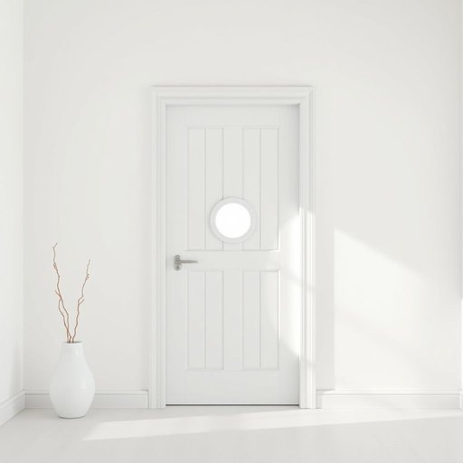

# peephole

<h1 style="font-size: 2.5em; font-weight: 300; letter-spacing: 2px; margin: 0; color: #2c3e50;">
/peephole*/
</h1>

---

---

## 例句

Before answering the door, I always make sure to carefully look through the peephole, which, despite its small size, offers a surprisingly clear view of anyone standing outside, allowing me to decide whether it’s safe to open without revealing myself prematurely.

*Before(/ˌbiˈfɔr/) answering(/ˈænsərɪŋ/) the(/ðə/) door,(/dɔr,/) I(/aɪ/) always(/ˈɔlˌweɪz/) make(/meɪk/) sure(/ʃʊr/) to(/tɪ/) carefully(/ˈkɛrfəli/) look(/lʊk/) through(/θru/) the(/ðə/) peephole,(/peephole*,/) which,(/wɪʧ,/) despite(/dɪˈspaɪt/) its(/ɪts/) small(/smɔl/) size,(/saɪz,/) offers(/ˈɔfərz/) a(/ə/) surprisingly(/səˈpraɪzɪŋli/) clear(/klɪr/) view(/vju/) of(/əv/) anyone(/ˈɛniˌwən/) standing(/ˈstændɪŋ/) outside,(/ˈaʊtˈsaɪd,/) allowing(/əˈlaʊɪŋ/) me(/mi/) to(/tɪ/) decide(/ˌdɪˈsaɪd/) whether(/ˈwɛðər/) it’s(/it’s*/) safe(/seɪf/) to(/tɪ/) open(/ˈoʊpən/) without(/wɪˈθaʊt/) revealing(/rɪˈvilɪŋ/) myself(/ˌmaɪˈsɛlf/) prematurely.(/ˌpriməˈʧʊrli./)*

**翻译：** 在开门之前，我总是先仔细通过猫眼观察，尽管猫眼很小，却能出乎意料地清晰看到站在门外的人，这让我能够判断是否安全开门，而不用提前暴露自己。

---

## 解释

peephole作为名词，主要指门上的小洞或窥视孔，便于室内的人通过这个小孔观察门外的情况，常见于家居安全设备中，比如防止陌生人直接开门时的安全措施。这种小孔通常装有玻璃或光学镜片，使用场合多见于住宅或办公室的大门，帮助人们先确认访客身份，防范潜在威胁。英语学习者在使用peephole时，应注意它是可数名词，通常搭配动词如look through the peephole（通过窥视孔观察），常用表达还有install a peephole（安装窥视孔）、check the peephole before opening the door（开门前通过窥视孔查看）等，形容词small或wide-angle常用来描述其类型。此外，peephole多用于实际物理结构，较少作为比喻。词源上，peephole由peep（偷看、窥视）和hole（孔洞）组合而成，直观表达了透过小孔窥视的功能，属于形象且功能明确的复合名词。在中文语境中，peephole准确翻译为猫眼，也称为门镜或窥视孔，是一种方便、安全的家居生活用品。它无褒贬色彩，属于中性词汇，但在文化层面，猫眼的普及反映了现代居家安全意识的普遍提升，因此具有一定的实用价值和社会意义。

---

<small style="color: #999; font-size: 0.9em;">2025-07-17 06:22:40</small>

