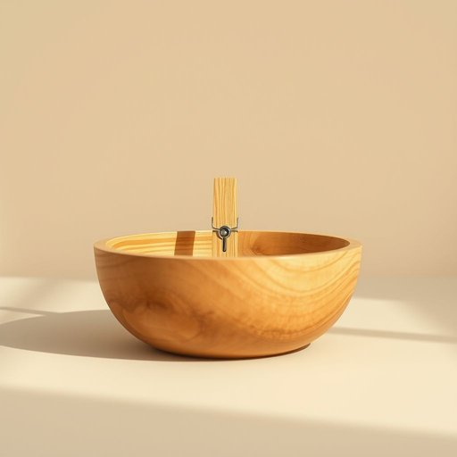

# peg

<h1 style="font-size: 2.5em; font-weight: 300; letter-spacing: 2px; margin: 0; color: #2c3e50;">
/pɛg/
</h1>

---

---

## 例句

The basket contains a wooden peg stronger than others, perfect for hanging clothes before the rain.

*The(/ðə/) basket(/ˈbæskət/) contains(/kənˈteɪnz/) a(/ə/) wooden(/ˈwʊdən/) peg(/pɛg/) stronger(/ˈstrɔŋgər/) than(/ðən/) others,(/ˈəðərz,/) perfect(/ˈpərˌfɪkt/) for(/fər/) hanging(/ˈhæŋɪŋ/) clothes(/kloʊðz/) before(/ˌbiˈfɔr/) the(/ðə/) rain.(/reɪn./)*

**翻译：** 篮子里有一枚比其他更结实的木夹子，十分适合在下雨前挂晾衣物。

---

## 解释

英语单词peg在家居生活用品的语境中作为名词，主要指用于悬挂衣物、固定物品或绑扎用的小钉子、夹子或栓子，最常见的是衣夹和晾衣夹，常用于晾晒衣物时夹住衣服防止被风吹落。这类peg一般材质为木头、塑料或金属，常见于家庭的阳台、洗衣区或储物空间。使用时需注意peg多为可数名词，单数为a peg，复数为pegs，常见的搭配有clothes peg、tent peg、coat peg，学习者应掌握其与动词hang、pin等的搭配用法。词源方面，peg起源于中古英语pegge，源自古挪威语pēg，指小木钉或销钉，最初用于固定或连接物品，含义沿用至今而扩展至不同类型的钉、夹。中文中peg在家居用品的语境下准确翻译为衣夹、夹子或钉子，根据具体形态和用途区别理解，无明显褒贬含义，属中性词汇，文化上peg与晾晒衣物紧密相关，体现生活中的实用工具角色，因此理解时侧重其实物功能和生活场景。

---

<small style="color: #999; font-size: 0.9em;">2025-07-17 06:22:40</small>

