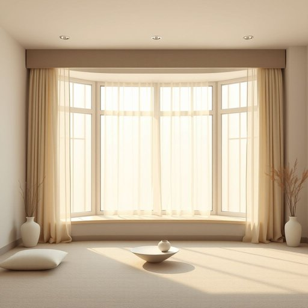

# pelmet

<h1 style="font-size: 2.5em; font-weight: 300; letter-spacing: 2px; margin: 0; color: #2c3e50;">
/pelmet*/
</h1>

---

---

## 例句

Although the curtains were already beautifully patterned, we decided to add a bespoke pelmet above the bay window, which not only concealed the curtain rods but also enhanced the overall warmth and elegance of the living room, making it feel much cozier during those chilly winter evenings.

*Although(/ˌɔlˈðoʊ/) the(/ðə/) curtains(/ˈkərtənz/) were(/wər/) already(/ɔˈrɛdi/) beautifully(/ˈbjutəfli/) patterned,(/ˈpætərnd,/) we(/wi/) decided(/ˌdɪˈsaɪdɪd/) to(/tɪ/) add(/æd/) a(/ə/) bespoke(/bespoke*/) pelmet(/pelmet*/) above(/əˈbəv/) the(/ðə/) bay(/beɪ/) window,(/ˈwɪndoʊ,/) which(/wɪʧ/) not(/nɑt/) only(/ˈoʊnli/) concealed(/kənˈsild/) the(/ðə/) curtain(/ˈkərtən/) rods(/rɑdz/) but(/bət/) also(/ˈɔlsoʊ/) enhanced(/ɛnˈhænst/) the(/ðə/) overall(/ˈoʊvərˌɔl/) warmth(/wɔrmθ/) and(/ənd/) elegance(/ˈɛləgəns/) of(/əv/) the(/ðə/) living(/ˈlɪvɪŋ/) room,(/rum,/) making(/ˈmeɪkɪŋ/) it(/ɪt/) feel(/fil/) much(/məʧ/) cozier(/ˈkoʊziər/) during(/ˈdʊrɪŋ/) those(/ðoʊz/) chilly(/ˈʧɪli/) winter(/ˈwɪntər/) evenings.(/ˈivnɪŋz./)*

**翻译：** 尽管窗帘已经有着优美的图案，我们仍决定在飘窗上方添加一个定制的窗帘盒，这不仅巧妙地隐藏了窗帘杆，还提升了客厅整体的温馨与雅致，使寒冷的冬夜中更添一份舒适与惬意。

---

## 解释

pelmet作为名词主要指家居环境中用于窗户顶部装饰的短布帘或饰板通常固定在窗帘杆上方覆盖窗帘轨道或杆子以美化窗户视效同时也能阻挡光线和减少空气流通提升保温效果它常见于英式装修风格或传统住宅的描述中多用于客厅卧室等有窗帘的空间英语学习者在使用pelmet时应注意它多作可数名词使用例如a pelmet或the pelmets并且通常与window窗户curtain窗帘等词搭配如a pelmet above the window或a fabric pelmet此外该词多用于正式或描述性的环境中口语中较少出现其词源来源于中古英语可能与法语palmette一种装饰图案相关反映其作为装饰性物件的本质在中文语境中pelmet最准确的翻译为窗帘盒或窗帘罩板有时也译作窗帘饰板或窗帘檐口强调其装饰和功能性的双重属性该词无明显褒贬色彩属于中性词汇主要用于家居装饰领域文化上反映了欧美传统住宅注重窗户美观和功能性的设计理念

---

<small style="color: #999; font-size: 0.9em;">2025-07-17 06:22:40</small>

