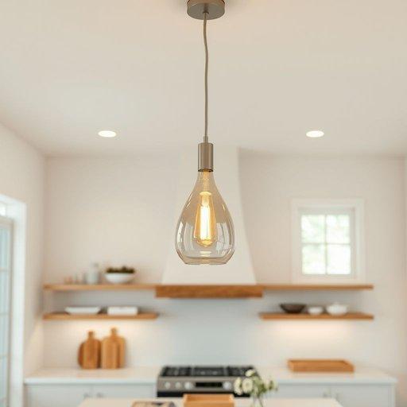

# pendant

<h1 style="font-size: 2.5em; font-weight: 300; letter-spacing: 2px; margin: 0; color: #2c3e50;">
/ˈpɛndənt/
</h1>

---

---

## 例句

I was so pleased with how the new pendant, which hangs elegantly from the kitchen ceiling and features intricate glasswork that catches the light beautifully, instantly transformed the entire room, adding a touch of sophistication and warmth that was previously missing.

*I(/aɪ/) was(/wɑz/) so(/soʊ/) pleased(/plizd/) with(/wɪθ/) how(/haʊ/) the(/ðə/) new(/nu/) pendant,(/ˈpɛndənt,/) which(/wɪʧ/) hangs(/hæŋz/) elegantly(/ˈɛlɪgənˌtli/) from(/frəm/) the(/ðə/) kitchen(/ˈkɪʧən/) ceiling(/ˈsilɪŋ/) and(/ənd/) features(/ˈfiʧərz/) intricate(/ˈɪntrəkət/) glasswork(/glasswork*/) that(/ðət/) catches(/ˈkæʧɪz/) the(/ðə/) light(/laɪt/) beautifully,(/ˈbjutəfli,/) instantly(/ˈɪnstəntli/) transformed(/trænsˈfɔrmd/) the(/ðə/) entire(/ɪnˈtaɪər/) room,(/rum,/) adding(/ˈædɪŋ/) a(/ə/) touch(/təʧ/) of(/əv/) sophistication(/səˌfɪstəˈkeɪʃən/) and(/ənd/) warmth(/wɔrmθ/) that(/ðət/) was(/wɑz/) previously(/ˈpriviəsli/) missing.(/ˈmɪsɪŋ./)*

**翻译：** 我非常满意那个新的吊灯，它优雅地悬挂在厨房天花板上，精美的玻璃工艺巧妙地捕捉光线，瞬间改变了整个房间，增添了一份此前缺失的典雅与温馨。

---

## 解释

英语单词“pendant”在家居生活用品的语境中作为名词，主要指悬挂的装饰物，通常是指悬挂在灯具上的装饰吊坠或项链上的吊坠。在具体使用场合上，“pendant”常见于描述室内灯具如吊灯（pendant light）上的装饰性部件，或指首饰中悬挂的装饰件，强调其悬挂的特性。英语学习者在使用该词时应注意，“pendant”作为名词时通常指“悬挂的物件”，其复数形式为“pendants”，且该词发音为/ˈpɛndənt/，容易与形容词“pending”（即“待定”）混淆。常见搭配有“pendant light”（悬挂灯）、“pendant necklace”（带有吊坠的项链），表达时应准确传达其“悬挂、垂下”的含义。词源上，“pendant”来自拉丁语“pendere”，意为“悬挂”，经中世纪法语“pendant”演变为英语，强调物体的挂悬状态。在中文语境中，“pendant”一词准确翻译为“吊坠”、“挂件”或“悬挂饰物”，特别是在家居生活用品中指“吊灯上的悬挂装饰”或“项链上的挂饰”，应避免将其误译为一般的“饰品”或“项链”，以免失去其“悬挂”的语义色彩。此词在文化和语义上通常中性，不带褒贬含义，但在设计与装饰语境中常体现精致、美观的审美价值。

---

<small style="color: #999; font-size: 0.9em;">2025-07-17 06:22:40</small>

