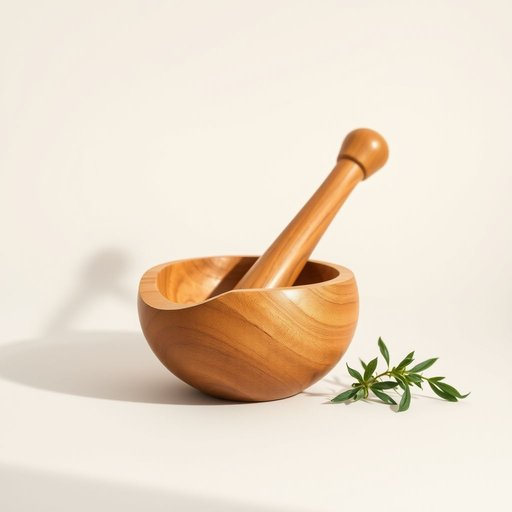

# pestle

<h1 style="font-size: 2.5em; font-weight: 300; letter-spacing: 2px; margin: 0; color: #2c3e50;">
/pestle*/
</h1>

---

---

## 例句

During the antique auction, the expert explained how the intricately carved pestle, used historically in traditional medicine, had become a valuable collector's item due to its unique craftsmanship and cultural significance.

*During(/ˈdʊrɪŋ/) the(/ðə/) antique(/ænˈtik/) auction,(/ˈɔkʃən,/) the(/ðə/) expert(/ˈɛkspərt/) explained(/ɪkˈspleɪnd/) how(/haʊ/) the(/ðə/) intricately(/ˈɪntrəkətli/) carved(/kɑrvd/) pestle,(/pestle*,/) used(/juzd/) historically(/hɪˈstɔrɪkəli/) in(/ɪn/) traditional(/trəˈdɪʃənəl/) medicine,(/ˈmɛdəsən,/) had(/hæd/) become(/bɪˈkəm/) a(/ə/) valuable(/ˈvæljəbəl/) collector's(/kəˈlɛktərz/) item(/ˈaɪtəm/) due(/du/) to(/tɪ/) its(/ɪts/) unique(/juˈnik/) craftsmanship(/ˈkræftsmənˌʃɪp/) and(/ənd/) cultural(/ˈkəlʧərəl/) significance.(/sɪgˈnɪfɪkəns./)*

**翻译：** 在古董拍卖会上，专家详解了这件雕工精美的杵工具，阐述了其在传统医药中的历史用途，以及因其独特的工艺和文化价值而成为珍贵收藏品的原因。

---

## 解释

英语单词“pestle”作为名词，在家居生活用品的语境中主要指用于捣碎、研磨食材或药材的棒状工具，通常配合研钵一起使用，常见于厨房或药房。其具体使用场合包括制作香料粉、调制酱料、研磨中草药等，属于传统的手工研磨工具。英语学习者在使用“pestle”时需注意其不可数用法较少见，通常以单数形式出现，且常与“mortar”搭配出现，如“mortar and pestle”，表示“研钵和杵”，表达时常置于复合结构中，需特别注意两者的联系和区分。此外，pestle多用作实物，较少用于比喻或引申意义，语法上不涉及时态变化。这个词源自拉丁语“pistellus”，源自动词“pinsere”，意为捣碎或压碎，反映了其工具功能的本质。在中文语境中，“pestle”准确对应的翻译是“杵”或“研杵”，强调其作为研磨工具的形态和用途，区别于单纯的“棒”或“棍”；在日常生活和烹饪中理解为“杵”最为贴切。该词本身无褒贬色彩，属于中性词汇，不含特殊文化内涵，但因其传统手工性质，常带有自然、质朴甚至复古的生活氛围，适合描述手工制作和天然食材处理场景。

---

<small style="color: #999; font-size: 0.9em;">2025-07-17 06:22:40</small>

