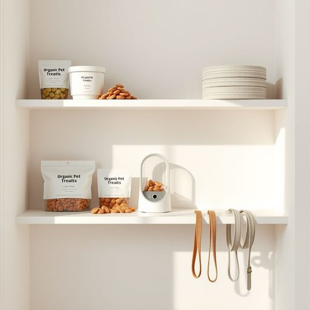

# pet-supply

<h1 style="font-size: 2.5em; font-weight: 300; letter-spacing: 2px; margin: 0; color: #2c3e50;">
/pet-supply*/
</h1>

---

---

## 例句

Before heading out to the park this afternoon, could you please check if we have enough pet supplies like the new organic treats, the refill for the water dispenser, and the extra leash tucked away in the cupboard, so we’re fully prepared for Baxter’s long walk?

*Before(/ˌbiˈfɔr/) heading(/ˈhɛdɪŋ/) out(/aʊt/) to(/tɪ/) the(/ðə/) park(/pɑrk/) this(/ðɪs/) afternoon,(/ˌæftərˈnun,/) could(/kʊd/) you(/ju/) please(/pliz/) check(/ʧɛk/) if(/ɪf/) we(/wi/) have(/hæv/) enough(/ɪˈnəf/) pet(/pɛt/) supplies(/səˈplaɪz/) like(/laɪk/) the(/ðə/) new(/nu/) organic(/ɔrˈgænɪk/) treats,(/trits,/) the(/ðə/) refill(/ˈrifɪl/) for(/fər/) the(/ðə/) water(/ˈwɔtər/) dispenser,(/dɪˈspɛnsər,/) and(/ənd/) the(/ðə/) extra(/ˈɛkstrə/) leash(/liʃ/) tucked(/təkt/) away(/əˈweɪ/) in(/ɪn/) the(/ðə/) cupboard,(/ˈkəbərd,/) so(/soʊ/) we’re(/we’re*/) fully(/ˈfʊli/) prepared(/priˈpɛrd/) for(/fər/) Baxter’s(/baxter’s*/) long(/lɔŋ/) walk?(/wɔk?/)*

**翻译：** 今天下午去公园之前，麻烦你先看看我们是否有足够的宠物用品，比如新的有机零食、水壶的补充装，以及橱柜里备用的牵引绳，这样我们才能为巴克斯特的长时间散步做好充分准备。

---

## 解释

“pet-supply”作为名词，主要指为宠物提供的各种用品或用品类别，通常涵盖宠物食品、玩具、护理产品、笼具和其他相关配件，具体使用场合多见于家居生活用品的购买、销售或讨论情境，如宠物店、超市的宠物用品区，以及与宠物照料相关的对话中，英语学习者在使用该词时应注意其复合结构由“pet”（宠物）和“supply”（供应、用品）组成，通常用复数形式“pet supplies”，且在语法上作为可数或不可数名词均可出现，但多数情况下指多种用品集合，以复数形式出现较常见，常见搭配有“pet-supply store”（宠物用品店）、“buy pet supplies”（购买宠物用品）、“pet-supply industry”（宠物用品行业）等，表达时注意连字符的使用，尤其用作形容词时，如“pet-supply chain”，必须连写，而单独名词用时可写作“pet supplies”，区别需掌握，词源上，“pet”源自拉丁语“pettis”，意指被人喜爱的动物或伴侣动物，“supply”源自拉丁语“supplere”，意为提供、补给，两词合成表达针对宠物的用品供给关系，反映现代社会对宠物生活质量及相关产业的重视，在中文语境中，“pet-supply”准确翻译为“宠物用品”或“宠物供应品”，侧重指为满足宠物日常生活和照顾需求的各种实物产品，该词无特殊褒贬色彩，文化内涵体现为现代人对宠物关怀和消费升级的社会现象，总的来说，“pet-supply”作为名词，是指与宠物相关的多样生活必需品，使用时应根据具体语境正确选用单复数及连字符形式，体现出宠物日用品的专业和系统性。

---

<small style="color: #999; font-size: 0.9em;">2025-07-17 06:22:40</small>

