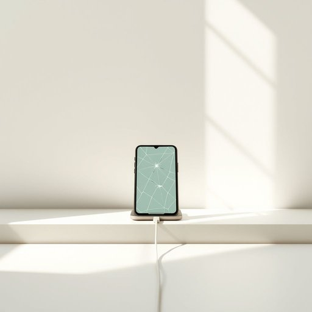

# phone

<h1 style="font-size: 2.5em; font-weight: 300; letter-spacing: 2px; margin: 0; color: #2c3e50;">
/foʊn/
</h1>

---

---

## 例句

Could you please hand me the phone that’s been charging by the window, the one with the cracked screen but surprisingly good battery life, so I can call mum and let her know we’ll be home a bit later than expected?

*Could(/kʊd/) you(/ju/) please(/pliz/) hand(/hænd/) me(/mi/) the(/ðə/) phone(/foʊn/) that’s(/that’s*/) been(/bɪn/) charging(/ˈʧɑrʤɪŋ/) by(/baɪ/) the(/ðə/) window,(/ˈwɪndoʊ,/) the(/ðə/) one(/wən/) with(/wɪθ/) the(/ðə/) cracked(/krækt/) screen(/skrin/) but(/bət/) surprisingly(/səˈpraɪzɪŋli/) good(/gʊd/) battery(/ˈbætəri/) life,(/laɪf,/) so(/soʊ/) I(/aɪ/) can(/kən/) call(/kɔl/) mum(/məm/) and(/ənd/) let(/lɛt/) her(/hər/) know(/noʊ/) we’ll(/we’ll*/) be(/bi/) home(/hoʊm/) a(/ə/) bit(/bɪt/) later(/ˈleɪtər/) than(/ðən/) expected?(/ɪkˈspɛktɪd?/)*

**翻译：** 你能把放在窗边充电的那部手机递给我吗？就是那部屏幕有裂痕但电池续航出乎意料地好的手机，好让我给妈妈打个电话，告诉她我们会比预期晚一点回家。

---

## 解释

英语单词phone作为名词在家居生活用品场景中，通常指电话机，即用于语音通讯的设备，包括固定电话和移动电话。具体使用场合多见于家庭环境，例如客厅的座机、卧室的手机或厨房里的无线电话，强调通信工具的实用性和方便性。在语法上，phone作为可数名词，单数形式为phone，复数形式为phones，可以与冠词、数量词搭配，如a phone、two phones，常与形容词连用，如mobile phone（手机）、landline phone（固定电话）。在表达技巧上，英语学习者应注意phone属正式或口语均适用词汇，避免与telephone混用时显得过于正式或书面。词源方面，phone来源于希腊语phōnē，意为声音或声音的传播，后被引入英语表示语音通讯设备，从19世纪末电话发明以来广泛使用。中文语境中，phone准确对应电话，涵盖手机和座机等含义，强调其作为家用通信工具的功能，没有特殊褒贬色彩，属于中性词汇，但在不同文化语境中手机使用的社会习惯和礼仪可能不同，使用时应注意场合礼貌。

---

<small style="color: #999; font-size: 0.9em;">2025-07-17 06:22:40</small>

