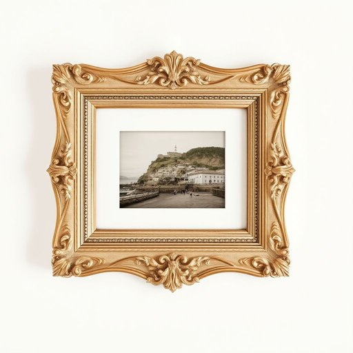

# picture

<h1 style="font-size: 2.5em; font-weight: 300; letter-spacing: 2px; margin: 0; color: #2c3e50;">
/ˈpɪkʧər/
</h1>

---

---

## 例句

The intricate design of the vintage frame became the centerpiece of the living room, drawing everyone's attention to the framed picture that Dad proudly brought back from his trip to Cornwall last summer.

*The(/ðə/) intricate(/ˈɪntrəkət/) design(/dɪˈzaɪn/) of(/əv/) the(/ðə/) vintage(/ˈvɪntɪʤ/) frame(/freɪm/) became(/bɪˈkeɪm/) the(/ðə/) centerpiece(/ˈsɛntərˌpis/) of(/əv/) the(/ðə/) living(/ˈlɪvɪŋ/) room,(/rum,/) drawing(/drɔɪŋ/) everyone's(/ˈɛvriˌwənz/) attention(/əˈtɛnʃən/) to(/tɪ/) the(/ðə/) framed(/freɪmd/) picture(/ˈpɪkʧər/) that(/ðət/) Dad(/dæd/) proudly(/ˈpraʊdli/) brought(/brɔt/) back(/bæk/) from(/frəm/) his(/hɪz/) trip(/trɪp/) to(/tɪ/) Cornwall(/ˈkɔrnwɔl/) last(/læst/) summer.(/ˈsəmər./)*

**翻译：** 复古相框精致的设计成为客厅的焦点，吸引着所有人的目光，凝视着那幅爸爸去年夏天自豪地带回康沃尔之旅的裱框画作。

---

## 解释

英语单词“picture”作为名词在家居生活用品场景中，通常指挂在墙上或摆放在室内的图画、照片、油画或装饰画，用于美化居住环境或表达个人品味。具体使用场合多见于描述墙面装饰、房间布置或谈论家中各种视觉艺术品时，如“hang a picture on the wall”（在墙上挂一幅画）。“picture”作为名词是可数名词，其单数和复数形式分别是picture和pictures，英语学习者在使用时应注意搭配常见的动词如hang, frame, display，以及形容词如beautiful, large, family等，常见表达还有“picture frame”（画框），“family picture”（家庭合影），“landscape picture”（风景画）等。词源上，“picture”源自拉丁语“pictura”，意指绘画或画像，传入英语后泛指任何用图像表现的视觉作品。在中文语境中，根据具体语境，“picture”一般译为“图片”、“画”、“画作”或“照片”，在家居环境下多译为“装饰画”或“挂画”，强调其作为摆设和美化空间的作用，没有强烈褒贬色彩，但在文化层面上，挂画往往体现主人的艺术爱好和文化修养，因此具有一定的审美和身份象征意义。

---

<small style="color: #999; font-size: 0.9em;">2025-07-17 06:22:40</small>

