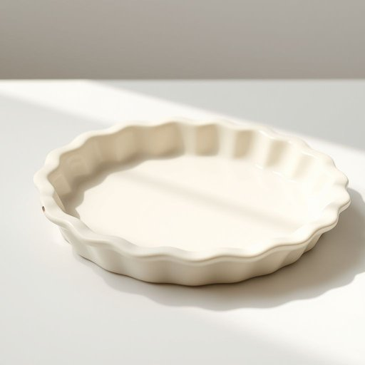

# pie-dish

<h1 style="font-size: 2.5em; font-weight: 300; letter-spacing: 2px; margin: 0; color: #2c3e50;">
/pie-dish*/
</h1>

---

---

## 例句

Before the meeting, she carefully placed the ceramic pie dish on the table, ensuring it was spotless and ready to hold the delicious dessert.

*Before(/ˌbiˈfɔr/) the(/ðə/) meeting,(/ˈmitɪŋ,/) she(/ʃi/) carefully(/ˈkɛrfəli/) placed(/pleɪst/) the(/ðə/) ceramic(/sərˈæmɪk/) pie(/paɪ/) dish(/dɪʃ/) on(/ɔn/) the(/ðə/) table,(/ˈteɪbəl,/) ensuring(/ɪnˈʃʊrɪŋ/) it(/ɪt/) was(/wɑz/) spotless(/ˈspɑtləs/) and(/ənd/) ready(/ˈrɛdi/) to(/tɪ/) hold(/hoʊld/) the(/ðə/) delicious(/dɪˈlɪʃəs/) dessert.(/dɪˈzərt./)*

**翻译：** 会议开始前，她细心地将陶瓷馅饼盘放在桌上，确保盘子一尘不染，准备盛放美味的甜点。

---

## 解释

英语单词“pie-dish”作为名词，指的是一种用于烘烤馅饼的盘子或容器，通常是圆形且边缘稍高，适合装填馅料并在烤箱中加热，常见材质有陶瓷、玻璃或金属，使用场合多见于厨房烹饪和家居餐具中。英语学习者在使用该词时应注意其为可数名词，复数形式为“pie-dishes”，常见搭配包括“a ceramic pie-dish”（一个陶瓷馅饼盘）、“a deep pie-dish”（一个深盘），以及与动词搭配如“put the pie in the pie-dish”（把馅饼放进馅饼盘），语法上无需特殊变形，但需避免与“pie”或“dish”单独使用时意思混淆。该词的词源由“pie”和“dish”两部分组成，“pie”源自中古英语，特指由面团包裹各种馅料的烘焙食品，“dish”则源于古英语“disc”，指容器或器皿，合成词“pie-dish”直接体现其功能和用途。在中文语境中，准确翻译为“馅饼盘”或“烤馅饼用的盘子”，强调其专用性和形状特征，不含褒贬意义，属于日常厨房用具的中性词汇，体现了西方烘焙文化中馅饼制作的专用容器，体现了一定的生活实用背景和文化接触。

---

<small style="color: #999; font-size: 0.9em;">2025-07-17 06:22:40</small>

