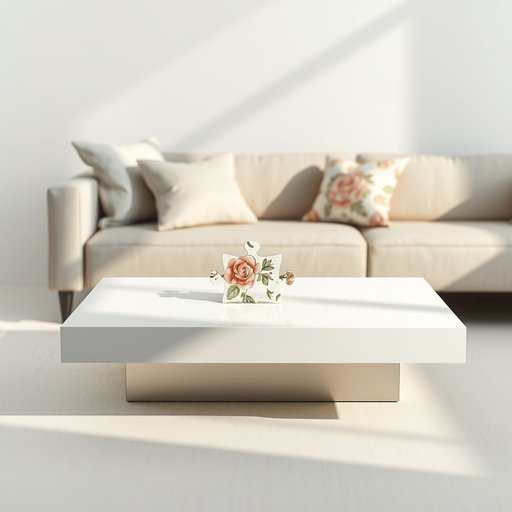

# piece

<h1 style="font-size: 2.5em; font-weight: 300; letter-spacing: 2px; margin: 0; color: #2c3e50;">
/pis/
</h1>

---

---

## 例句

Could you please pass me that piece of the puzzle that's been missing from the coffee table, the one with the intricate floral pattern that matches the cushions on the sofa?

*Could(/kʊd/) you(/ju/) please(/pliz/) pass(/pæs/) me(/mi/) that(/ðət/) piece(/pis/) of(/əv/) the(/ðə/) puzzle(/ˈpəzəl/) that's(/ðæts/) been(/bɪn/) missing(/ˈmɪsɪŋ/) from(/frəm/) the(/ðə/) coffee(/ˈkɔfi/) table,(/ˈteɪbəl,/) the(/ðə/) one(/wən/) with(/wɪθ/) the(/ðə/) intricate(/ˈɪntrəkət/) floral(/ˈflɔrəl/) pattern(/ˈpætərn/) that(/ðət/) matches(/ˈmæʧɪz/) the(/ðə/) cushions(/ˈkʊʃənz/) on(/ɔn/) the(/ðə/) sofa?(/ˈsoʊfə?/)*

**翻译：** 您能把那个一直缺失在茶几上的拼图块递给我吗？就是那块带有与沙发靠垫花纹相呼应的精致花卉图案的拼图。

---

## 解释

英语单词"piece"在家居生活用品的语境中作为名词，通常表示“一件、一块、一片”具体的物品单元，比如一件家具（a piece of furniture）、一片面包（a piece of bread）、一块布料（a piece of cloth）等，常用于指代某物的单个部分或整体中的一个单位。使用时，"piece"通常后接表示物品的名词，是可数名词，且常见搭配有"a piece of + 单数不可数名词"（如a piece of cake、一块蛋糕）或直接用作指代家具、装饰等单件物品（a piece of furniture、一件家具）；学习者应注意"piece"表达的是单个单元，区别于整体或复数形式，且在量词搭配中需要冠词"a"或数字修饰。词源上，"piece"源自中古法语"pice"，最终源自拉丁语"pecia"或"petia"，意为“片段、部分”，反映了该词表示部分或单个单位的基本含义。在中文语境中，"piece"通常准确翻译为“件”“块”“片”等，需根据具体物品属性选择合适译法，例如家具多译为“件”，布料或食物可译作“块”或“片”。该词本身在家居用品场景中无褒贬含义，属于中性词，用于计量或描述物品，文化内涵较弱，但需结合实际语境避免误用整体或数量表达。

---

<small style="color: #999; font-size: 0.9em;">2025-07-17 06:22:40</small>

