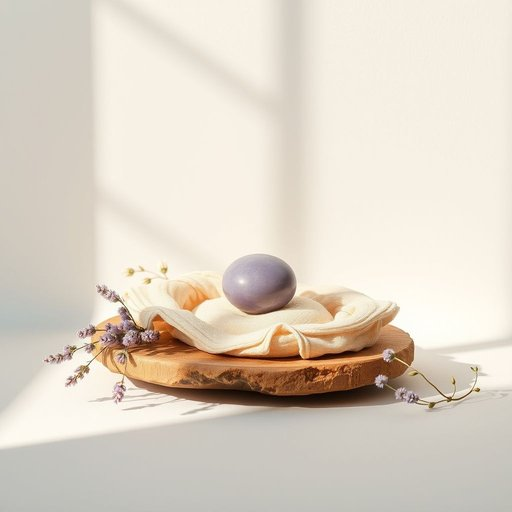

# pillow

<h1 style="font-size: 2.5em; font-weight: 300; letter-spacing: 2px; margin: 0; color: #2c3e50;">
/ˈpɪloʊ/
</h1>

---

---

## 例句

The intricate design of the pillow, which her grandmother had meticulously sewn by hand, combined both the familiar texture and the gentle lavender fragrance to create a comforting presence that eased her into a peaceful night's sleep despite the chilly draft sneaking in through the old window.

*The(/ðə/) intricate(/ˈɪntrəkət/) design(/dɪˈzaɪn/) of(/əv/) the(/ðə/) pillow,(/ˈpɪloʊ,/) which(/wɪʧ/) her(/hər/) grandmother(/ˈgrændˌməðər/) had(/hæd/) meticulously(/məˈtɪkjələsli/) sewn(/soʊn/) by(/baɪ/) hand,(/hænd,/) combined(/kəmˈbaɪnd/) both(/boʊθ/) the(/ðə/) familiar(/fəˈmɪljər/) texture(/ˈtɛksʧər/) and(/ənd/) the(/ðə/) gentle(/ˈʤɛnəl/) lavender(/ˈlævəndər/) fragrance(/ˈfreɪgrəns/) to(/tɪ/) create(/kriˈeɪt/) a(/ə/) comforting(/ˈkəmfərtɪŋ/) presence(/ˈprɛzəns/) that(/ðət/) eased(/izd/) her(/hər/) into(/ˈɪntu/) a(/ə/) peaceful(/ˈpisfəl/) night's(/naɪts/) sleep(/slip/) despite(/dɪˈspaɪt/) the(/ðə/) chilly(/ˈʧɪli/) draft(/dræft/) sneaking(/sˈnikɪŋ/) in(/ɪn/) through(/θru/) the(/ðə/) old(/oʊld/) window.(/ˈwɪndoʊ./)*

**翻译：** 那个枕头复杂的设计，是她祖母一针一线精心缝制而成，既有熟悉的质感，又散发着淡淡的薰衣草清香，营造出一种慰藉的氛围，让她即使在透过老窗户吹进的阵阵寒风中，也能安然入睡，享受一夜的宁静。

---

## 解释

英语单词“pillow”作为名词在家居生活用品的语境中，指用于枕头或垫头部以提供舒适和支撑的软垫，通常放置在床上供人睡觉时使用，也可用于沙发、椅子等地方增加休息的舒适感。具体使用场合多见于日常生活对睡眠环境的描述，如“sleeping on a pillow”（睡在枕头上）、“fluff the pillow”（拍松枕头）等情景中。英语学习者在使用“pillow”时需要注意它是一个可数名词，表示具体的物品时需加冠词（a pillow）或复数形式（pillows）；另外，“pillow case”表示枕套，是其常见搭配，且“pillow”在某些固定表达中如“pillow talk”具有特殊含义，指恋人间的私语，属于文化隐喻。该词源自中古英语“pilwe”，来自古英语“pyle”或“pylew”，进一步追溯到拉丁语“pulvinus”，意指软垫。中文语境中，“pillow”准确翻译为“枕头”，强调其作为睡眠用品的功能，既包括传统的布制软垫，也涵盖现代各种填充物的类型。在文化色彩上，“pillow”属于中性词，没有明显褒贬，只是在某些文学或口语表达中可能隐含温馨、私密的情感色彩。

---

<small style="color: #999; font-size: 0.9em;">2025-07-17 06:22:40</small>

