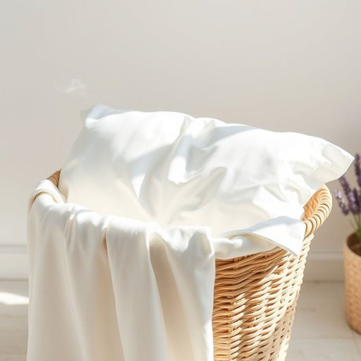

# pillowcase

<h1 style="font-size: 2.5em; font-weight: 300; letter-spacing: 2px; margin: 0; color: #2c3e50;">
/pillowcase*/
</h1>

---

---

## 例句

Could you please check if the pillowcase in the laundry basket, which has that subtle lavender scent we both like, needs changing before we put the fresh sheets on the bed later this evening?

*Could(/kʊd/) you(/ju/) please(/pliz/) check(/ʧɛk/) if(/ɪf/) the(/ðə/) pillowcase(/pillowcase*/) in(/ɪn/) the(/ðə/) laundry(/ˈlɔndri/) basket,(/ˈbæskət,/) which(/wɪʧ/) has(/həz/) that(/ðət/) subtle(/ˈsətəl/) lavender(/ˈlævəndər/) scent(/sɛnt/) we(/wi/) both(/boʊθ/) like,(/laɪk,/) needs(/nidz/) changing(/ˈʧeɪnʤɪŋ/) before(/ˌbiˈfɔr/) we(/wi/) put(/pʊt/) the(/ðə/) fresh(/frɛʃ/) sheets(/ʃits/) on(/ɔn/) the(/ðə/) bed(/bɛd/) later(/ˈleɪtər/) this(/ðɪs/) evening?(/ˈivnɪŋ?/)*

**翻译：** 请帮忙确认一下洗衣篮里那只带有我们都喜欢的淡淡薰衣草香味的枕套，今晚我们换上干净床单之前是否需要更换？

---

## 解释

英语单词“pillowcase”作为名词，指的是用来套在枕头外面的布套，主要功能是保护枕头免受污渍和磨损，常见于卧室家居生活场景中，如整理床铺、换洗床单时会用到。英语学习者使用该词时应注意其复合结构由“pillow”（枕头）和“case”（套子）组成，属于可数名词，单复数形式分别为“pillowcase”和“pillowcases”，不可与复数动词混淆，常见搭配包括“change the pillowcase”（换枕套）、“cotton pillowcase”（棉质枕套）、“silk pillowcase”（丝绸枕套）等，表达时也可根据材质、颜色或图案进行细化描述。词源来源于古英语“pillow”意为枕头，与“case”指包裹物，合成词体现了物品保护功能，结构简单透明，无特殊隐喻或褒贬色彩，文化意义较为通用且中性。在中文语境中，准确翻译为“枕套”或“枕头套”，强调其作为枕头外罩的实用性，避免误解为枕头本身，理解时应结合日常生活中的更换和清洁过程，确保词义清晰无歧义。

---

<small style="color: #999; font-size: 0.9em;">2025-07-17 06:22:40</small>

