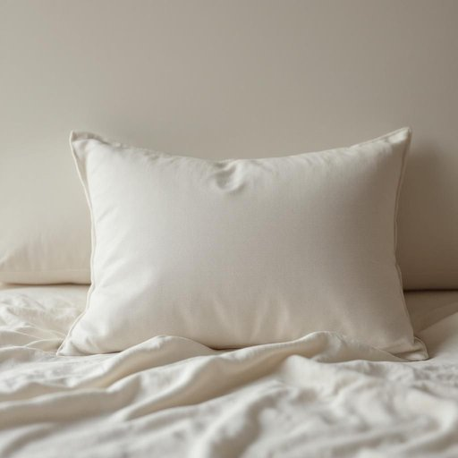

# pillowslip

<h1 style="font-size: 2.5em; font-weight: 300; letter-spacing: 2px; margin: 0; color: #2c3e50;">
/pillowslip*/
</h1>

---

---

## 例句

The pillowslip on the guest room pillow, which was bought last week from that new homeware store on Camden High Street, matches the rest of the bedding perfectly, creating a cohesive and inviting look.

*The(/ðə/) pillowslip(/pillowslip*/) on(/ɔn/) the(/ðə/) guest(/gɛst/) room(/rum/) pillow,(/ˈpɪloʊ,/) which(/wɪʧ/) was(/wɑz/) bought(/bɔt/) last(/læst/) week(/wik/) from(/frəm/) that(/ðət/) new(/nu/) homeware(/homeware*/) store(/stɔr/) on(/ɔn/) Camden(/ˈkæmdən/) High(/haɪ/) Street,(/strit,/) matches(/ˈmæʧɪz/) the(/ðə/) rest(/rɛst/) of(/əv/) the(/ðə/) bedding(/ˈbɛdɪŋ/) perfectly,(/ˈpərfəktli,/) creating(/kriˈeɪtɪŋ/) a(/ə/) cohesive(/koʊˈhisɪv/) and(/ənd/) inviting(/ˌɪnˈvaɪtɪŋ/) look.(/lʊk./)*

**翻译：** 客房枕套是上周在坎登高街那家新开的家居用品店购买的，与床上其他寝具完美搭配，营造出统一而温馨的氛围。

---

## 解释

pillowslip作为名词，主要指的是枕套，即套在枕头外面的布套，用于保护枕头、保持清洁和提供舒适感，常见于家居生活用品的语境中，尤其是在谈论床上用品、卧室布置或清洁保养时使用。英语学习者在使用pillowslip时需注意它是可数名词，复数形式为pillowslips，且通常与动词put on（套上）、wash（清洗）、change（更换）等搭配。此外，pillowslip常见的固定搭配包括change the pillowslip（更换枕套）、remove the pillowslip（取下枕套）等。该词来源于早期英语中pillow（枕头）与slip（滑动或套子）的组合，意为能滑套在枕头上的布套，反映了其功能性和物理特点。中文中，准确的翻译为枕套，这是该词最直接且广泛接受的对应表达，没有特殊褒贬色彩或文化内涵，属于中性词汇，说明其功能而非审美评价，是日常生活中常见的床上用品术语。

---

<small style="color: #999; font-size: 0.9em;">2025-07-17 06:22:40</small>

