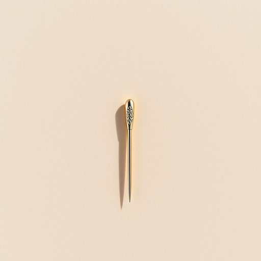

# pin

<h1 style="font-size: 2.5em; font-weight: 300; letter-spacing: 2px; margin: 0; color: #2c3e50;">
/pɪn/
</h1>

---

---

## 例句

Could you please hand me that pin from the sewing kit on the table, the one with the colourful head that Granny always insists is the best for keeping fabric layers neatly together when she’s making her quilts?

*Could(/kʊd/) you(/ju/) please(/pliz/) hand(/hænd/) me(/mi/) that(/ðət/) pin(/pɪn/) from(/frəm/) the(/ðə/) sewing(/soʊɪŋ/) kit(/kɪt/) on(/ɔn/) the(/ðə/) table,(/ˈteɪbəl,/) the(/ðə/) one(/wən/) with(/wɪθ/) the(/ðə/) colourful(/colourful*/) head(/hɛd/) that(/ðət/) Granny(/ˈgræni/) always(/ˈɔlˌweɪz/) insists(/ˌɪnˈsɪsts/) is(/ɪz/) the(/ðə/) best(/bɛst/) for(/fər/) keeping(/ˈkipɪŋ/) fabric(/ˈfæbrɪk/) layers(/leɪərz/) neatly(/ˈnitli/) together(/təˈgɛðər/) when(/wɪn/) she’s(/she’s*/) making(/ˈmeɪkɪŋ/) her(/hər/) quilts?(/kwɪlts?/)*

**翻译：** 你能把桌子上缝纫包里的那根大头针递给我吗？就是奶奶总说它是缝制被子时固定织物层最好的那种，针头是五彩斑斓的那个。

---

## 解释

英语单词“pin”作为名词在家居生活用品的语境中，通常指的是一种细长的小型金属针，用于固定衣物、布料或装饰品，常见如别针、安全别针、图钉等，具体使用场合包括缝纫、挂画、固定布料或者办公桌上的图钉板。学习者在使用“pin”时需注意其单数和复数形式（pin/pins），以及与动词搭配时的固定表达，如“to pin something on/with a pin”（用别针固定某物），此外，表达技巧上可以结合具体品种如“safety pin”（安全别针）、“push pin”（图钉）以增强表达准确性。词源方面，“pin”源自古英语“pinn”，意指细长的小钉，历史上用于固定或连接物品，含义延续至今。在中文语境中，“pin”对应的翻译通常为“别针”、“针”或“图钉”，依据具体实物定位，其核心含义是用于固定或连接的细长小物件。该词本身无褒贬色彩，是中性词汇，文化内涵相对简单，主要体现实用功能性，使用时注意其在不同家用品中的具体种类和功能，以便准确表达。

---

<small style="color: #999; font-size: 0.9em;">2025-07-17 06:22:40</small>

