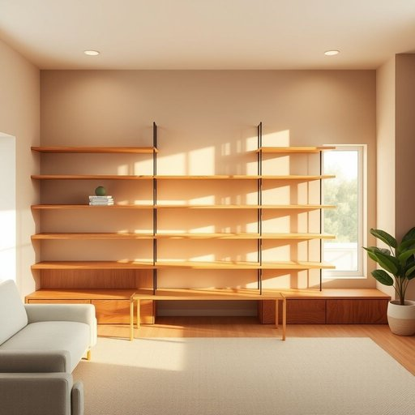

# pine

<h1 style="font-size: 2.5em; font-weight: 300; letter-spacing: 2px; margin: 0; color: #2c3e50;">
/paɪn/
</h1>

---

---

## 例句

I decided to renovate the living room by installing a new set of shelves made from reclaimed pine, which not only adds a warm, rustic charm to the space but, thanks to its sturdy grain and natural finish, also ensures that the furniture withstands daily wear and tear without losing its elegant appeal.

*I(/aɪ/) decided(/ˌdɪˈsaɪdɪd/) to(/tɪ/) renovate(/ˈrɛnəˌveɪt/) the(/ðə/) living(/ˈlɪvɪŋ/) room(/rum/) by(/baɪ/) installing(/ˌɪnˈstɔlɪŋ/) a(/ə/) new(/nu/) set(/sɛt/) of(/əv/) shelves(/ʃɛlvz/) made(/meɪd/) from(/frəm/) reclaimed(/riˈkleɪmd/) pine,(/paɪn,/) which(/wɪʧ/) not(/nɑt/) only(/ˈoʊnli/) adds(/ædz/) a(/ə/) warm,(/wɔrm,/) rustic(/ˈrəstɪk/) charm(/ʧɑrm/) to(/tɪ/) the(/ðə/) space(/speɪs/) but,(/bət,/) thanks(/θæŋks/) to(/tɪ/) its(/ɪts/) sturdy(/ˈstərdi/) grain(/greɪn/) and(/ənd/) natural(/ˈnæʧərəl/) finish,(/ˈfɪnɪʃ,/) also(/ˈɔlsoʊ/) ensures(/ɪnˈʃʊrz/) that(/ðət/) the(/ðə/) furniture(/ˈfərnɪʧər/) withstands(/wɪθˈstændz/) daily(/ˈdeɪli/) wear(/wɛr/) and(/ənd/) tear(/tɪr/) without(/wɪˈθaʊt/) losing(/ˈluzɪŋ/) its(/ɪts/) elegant(/ˈɛləgənt/) appeal.(/əˈpil./)*

**翻译：** 我决定通过安装一套由再生松木制成的新书架来翻新客厅，这不仅为空间增添了温暖质朴的魅力，而且得益于其坚固的纹理和天然的饰面，使家具能够经受日常磨损而不失优雅风采。

---

## 解释

英语单词“pine”作为名词在家居生活用品场景中，通常指“松树”或“松木”，这是一种常见的木材原料，用于制作家具、地板、装饰板等家居产品。具体使用场合一般涉及木材种类的描述，如“pine wood table”（松木桌子）、“pine flooring”（松木地板）等，表达时多指材质而非植物本身。英语学习者在使用“pine”作为名词时要注意，它既可以指代树木本身，也可以指松木材质，常见搭配包括“pine wood”、“a board of pine”等，且作为可数名词时应注意单复数形式“pine”与“pines”的区分。此外，“pine”也作为动词存在，意为“渴望、思念”，但在家居用品情境下应避免混淆。词源上，“pine”源自古英语“pīn”或“pīnīa”，源于拉丁语“pinus”，意指松树，反映其古老的植物学分类背景。在中文语境中，“pine”作为家居相关名词应准确译为“松树”或“松木”，强调其作为木材原料的属性，避免误解为其他松属植物或与动词意义混淆。总体而言，该词在家居语境中中性无褒贬含义，属于中性词汇，但因松木材质质感温暖、纹理美观，常带有自然、环保、质朴的积极文化内涵。

---

<small style="color: #999; font-size: 0.9em;">2025-07-17 06:22:40</small>

