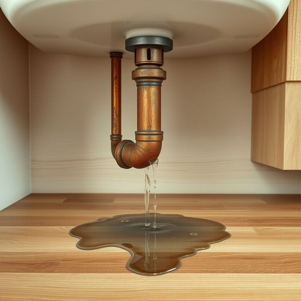

# pipe

<h1 style="font-size: 2.5em; font-weight: 300; letter-spacing: 2px; margin: 0; color: #2c3e50;">
/paɪp/
</h1>

---

---

## 例句

I had to call a plumber this morning because the old copper pipe under the kitchen sink, which had been leaking slowly for weeks despite my attempts to tighten the fittings, finally burst, flooding the cupboard and causing water damage to the wooden floorboards.

*I(/aɪ/) had(/hæd/) to(/tɪ/) call(/kɔl/) a(/ə/) plumber(/ˈpləmər/) this(/ðɪs/) morning(/ˈmɔrnɪŋ/) because(/bɪˈkəz/) the(/ðə/) old(/oʊld/) copper(/ˈkɑpər/) pipe(/paɪp/) under(/ˈəndər/) the(/ðə/) kitchen(/ˈkɪʧən/) sink,(/sɪŋk,/) which(/wɪʧ/) had(/hæd/) been(/bɪn/) leaking(/ˈlikɪŋ/) slowly(/sˈloʊli/) for(/fər/) weeks(/wiks/) despite(/dɪˈspaɪt/) my(/maɪ/) attempts(/əˈtɛmpts/) to(/tɪ/) tighten(/ˈtaɪtən/) the(/ðə/) fittings,(/ˈfɪtɪŋz,/) finally(/ˈfaɪnəli/) burst,(/bərst,/) flooding(/ˈflədɪŋ/) the(/ðə/) cupboard(/ˈkəbərd/) and(/ənd/) causing(/ˈkɔzɪŋ/) water(/ˈwɔtər/) damage(/ˈdæmɪʤ/) to(/tɪ/) the(/ðə/) wooden(/ˈwʊdən/) floorboards.(/ˈflɔrˌbɔrdz./)*

**翻译：** 今天早上我不得不叫了个水管工，因为厨房水槽下的那根老旧铜管，尽管我多次尝试拧紧接头，但几周来仍在慢慢漏水，终于爆裂，淹了橱柜，还导致木地板受损。

---

## 解释

英语单词“pipe”在家居生活用品语境中作为名词，通常指的是用于输送水、气体或废水的管道或管子，具体使用场合包括家庭水管系统、暖气管道、排水管等，例如水龙头下面连接的pipe用于输水，或供暖系统中的pipe负责热水循环。英语学习者使用该词时需要注意其通常为可数名词，可以用复数形式pipes表示多根管子；常见搭配包括water pipe（水管）、gas pipe（燃气管）、drain pipe（排水管）等。此外，pipe fitting指管件，构成复杂管道系统，表达上常与具体材质或用途连用。词源上，pipe源自拉丁语pipare，意为吹奏嘴，后来演变为中世纪英语中指细长中空物体，因其形状与吹奏乐器相似而得名。中文语境中，pipe通常准确翻译为管道或管子，强调其输送功能，与水管、燃气管等家居常用术语对应，且无褒贬色彩，属于中性实用词汇。需要注意的是，pipe亦有其他含义，如烟斗，但在家居设备语境中应避免混淆，确保根据上下文准确理解和使用。

---

<small style="color: #999; font-size: 0.9em;">2025-07-17 06:22:40</small>

